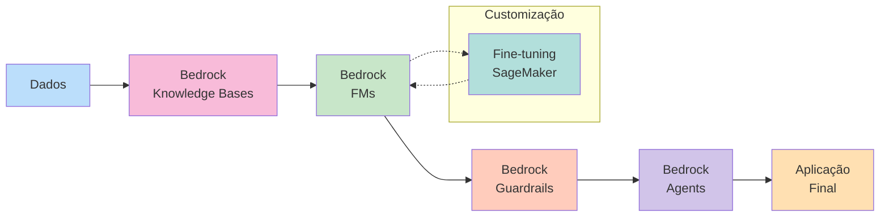
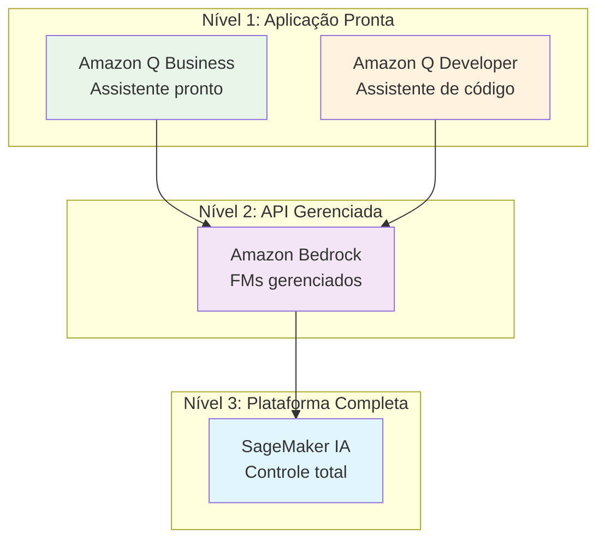
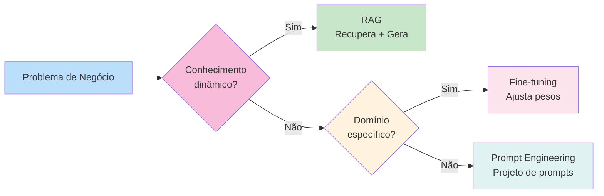

# 🌟 Fundamentos de IA Generativa

| Certificado | Certificado |
| :--- | :---: |
| **Fundamentals of Generative AI** (AWS) | [](https://github.com/JoaoIto/aws-skills/blob/main/aws-ai-practitioner/developing-AI-generative-solutions/docs/developing-AI-generative-solutions.pdf) |

> **Curso: Fundamentals of Generative AI | Plano de Estudos AWS AI Practitioner | Nível: Fundamental**

---

## 📖 Visão Geral

O curso **Fundamentals of Generative AI** é o quinto módulo do **Plano de Estudos AWS Artificial Intelligence Practitioner**. Ele fornece uma introdução abrangente aos conceitos fundamentais de IA generativa, incluindo tokens, embeddings, modelos de base (foundation models), arquiteturas de transformadores, modelos multimodais e modelos de difusão. Você também explorará as capacidades e limitações da IA generativa, os serviços da AWS para construir aplicações de IA generativa e as considerações de custo associadas.

Este módulo é o **próximo passo** após a conclusão do curso **Developing Machine Learning Solutions**.

Este documento é baseado **exclusivamente** na documentação oficial da AWS:
- [AWS Certified AI Practitioner (AIF-C01) Exam Guide](https://d1.awsstatic.com/training-and-certification/docs-ai-practitioner/AWS-Certified-AI-Practitioner_Exam-Guide.pdf)
- [AWS Skill Builder - AI Practitioner Learning Plan](https://explore.skillbuilder.aws/)
- [Amazon Bedrock Documentation](https://docs.aws.amazon.com/bedrock/)
- [Amazon SageMaker Documentation](https://docs.aws.amazon.com/sagemaker/)
- [AWS AI Services](https://aws.amazon.com/ai/)

---

## 📊 Peso no Exame AIF-C01

| Domínio | Peso | Task Statements |
|---------|------|-----------------|
| **Domain 2: Fundamentals of Generative AI** | **24%** | 2.1, 2.2, 2.3 |

---

## 1. 🎯 Conceitos Fundamentais de IA Generativa

### 1.1 O que é IA Generativa?

A **IA generativa** é um ramo da inteligência artificial que cria **novo conteúdo** — texto, imagens, áudio, vídeo, código — a partir de padrões aprendidos em grandes conjuntos de dados. Ao contrário da IA tradicional (que classifica ou prevê), a IA generativa **produz** conteúdo original.

| Característica | IA Tradicional | IA Generativa |
|----------------|----------------|---------------|
| **Saída** | Classificação, previsão, detecção | Conteúdo novo (texto, imagem, código, áudio) |
| **Treinamento** | Dados específicos para tarefa | Foundation Models (FMs) pré-treinados |
| **Exemplos** | Sistemas de recomendação, detecção de spam | Chatbots, geração de imagens, escrita de código |
| **Determinismo** | Alta (mesma entrada → mesma saída) | Baixa (mesma entrada → saídas variadas) |

### 1.2 Tokens

Um **token** é a menor unidade de significado que um modelo de linguagem processa. Em português e inglês, um token equivale aproximadamente a **0.75 de uma palavra** (ou seja, 4 tokens ≈ 3 palavras).

| Aspecto | Detalhe |
|---------|---------|
| **Definição** | Unidade básica de significado processada por LLMs |
| **Tamanho aproximado** | ~0.75 palavras em inglês |
| **Função 1** | Define a **janela de contexto** (context window) |
| **Função 2** | Determina o **custo** (billing por token) |
| **Exemplo** | "Hello, how are you?" → ~5 tokens |

> **Importante:** A janela de contexto é um **orçamento compartilhado** entre o prompt de entrada (input) e a resposta gerada (output). Se o prompt for muito longo, sobra menos espaço para a resposta.

### 1.3 Embeddings

**Embeddings** são representações numéricas (vetoriais) de texto, imagens ou outros dados. Eles capturam o **significado semântico** e permitem comparações matemáticas entre diferentes entradas.

| Característica | Descrição |
|----------------|-----------|
| **Formato** | Vetores de alta dimensionalidade (ex: 1.536 dimensões) |
| **Uso** | Busca semântica, similaridade, RAG |
| **Exemplo** | "Cachorro" e "cão" têm embeddings próximos no espaço vetorial |

### 1.4 Chunking

**Chunking** é o processo de dividir dados (especialmente texto) em pedaços menores e gerenciáveis, chamados **chunks**, antes de convertê-los em embeddings.

| Etapa | Descrição |
|-------|-----------|
| **1. Divisão** | Texto dividido em blocos de N tokens (ex: 512 tokens) |
| **2. Embedding** | Cada chunk é convertido em um vetor de embedding |
| **3. Armazenamento** | Vetores armazenados em um **vector database** |
| **4. Recuperação** | Query é convertida em embedding e comparada com os chunks armazenados |

> **Dica:** O tamanho do chunk afeta a qualidade da recuperação. Chunks muito grandes perdem precisão; chunks muito pequenos perdem contexto.

### 1.5 Transformer-based LLMs

**Transformers** são a arquitetura neural dominante por trás dos grandes modelos de linguagem (LLMs). Introduzida em 2017 pelo paper "Attention Is All You Need", a arquitetura de transformador usa o mecanismo de **auto-atenção** (self-attention) para processar sequências de tokens em paralelo.

| Componente | Função |
|------------|--------|
| **Self-Attention** | Cada token "presta atenção" a todos os outros tokens na sequência |
| **Multi-Head Attention** | Múltiplas cabeças de atenção capturam diferentes relações |
| **Feed-Forward Layers** | Processamento adicional após a atenção |
| **Positional Encoding** | Injeta informação de posição dos tokens |

### 1.6 Foundation Models (FMs)

**Foundation Models** são modelos de IA pré-treinados em grandes volumes de dados gerais, que podem ser **adaptados** (via prompting, fine-tuning ou RAG) para tarefas específicas.

| Característica | Descrição |
|----------------|-----------|
| **Preço de treinamento** | Muito alto (milhões de dólares) |
| **Reaproveitamento** | Um FM pode ser adaptado para múltiplas tarefas |
| **Exemplos** | Amazon Titan, Anthropic Claude, Meta Llama, Cohere, Mistral |
| **Vantagem** | Evita o custo de treinar modelos do zero |

### 1.7 Multimodal Models

**Modelos multimodais** podem processar e gerar conteúdo em **múltiplas modalidades** — texto, imagem, áudio, vídeo — simultaneamente.

| Modelo | Modalidades Suportadas | Exemplo de Uso |
|--------|----------------------|----------------|
| **Claude 3** | Texto + Imagem | Analisar um gráfico e gerar um relatório |
| **GPT-4V** | Texto + Imagem | Descrever o conteúdo de uma foto |
| **Gemini** | Texto + Imagem + Áudio + Vídeo | Entender um vídeo e responder perguntas sobre ele |

### 1.8 Diffusion Models

**Modelos de difusão** são uma classe de modelos generativos que geram imagens (e outros dados) a partir de ruído aleatório, iterativamente refinando a saída.

| Etapa | Descrição |
|-------|-----------|
| **1. Forward Diffusion** | Imagem original é gradualmente corrompida com ruído |
| **2. Reverse Diffusion** | Modelo aprende a remover o ruído para gerar imagens |
| **3. Geração** | Partindo de ruído puro, o modelo gera uma nova imagem |

> **Exemplo:** Stable Diffusion, Amazon Titan Image Generator

### 1.9 Prompt Engineering

**Prompt Engineering** é a prática de projetar entradas (prompts) eficazes para obter respostas desejadas de modelos de IA generativa.

| Técnica | Descrição | Exemplo |
|---------|-----------|---------|
| **Zero-shot** | Prompt sem exemplos | "Traduza 'hello' para português" |
| **Few-shot** | Prompt com alguns exemplos | "Traduza: hello→olá, goodbye→adeus, thank you→" |
| **Chain-of-Thought** | Incentiva o modelo a raciocinar passo a passo | "Primeiro, identifique... Em seguida, calcule..." |
| **Prompt Templates** | Estruturas reutilizáveis com variáveis | "Resuma o seguinte texto: {texto}" |

| Parâmetro | Função | Efeito |
|-----------|--------|--------|
| **Temperature** | Controla aleatoriedade | Baixo = mais determinístico; Alto = mais criativo |
| **Top-p (nucleus)** | Filtra tokens por probabilidade cumulativa | Reduz escolhas improváveis |
| **Max tokens** | Limite de tokens na saída | Controla o tamanho da resposta |

---

## 2. 🔄 Ciclo de Vida de Foundation Models

O ciclo de vida de um Foundation Model abrange desde a seleção de dados até o feedback contínuo em produção.

### 2.1 Fases do Ciclo de Vida

| # | Fase | Descrição |
|---|------|-----------|
| 1 | **Data Selection** | Seleção e curadoria de dados de alta qualidade para treinamento |
| 2 | **Model Selection** | Escolha do FM mais adequado (tamanho, modalidade, provedor) |
| 3 | **Pre-training** | Treinamento em grandes volumes de dados não rotulados |
| 4 | **Fine-tuning** | Ajuste do modelo com dados específicos do domínio |
| 5 | **Evaluation** | Avaliação do desempenho com métricas e benchmarks |
| 6 | **Deployment** | Implantção do modelo em produção |
| 7 | **Feedback** | Coleta de feedback para iterações futuras |

### 2.2 Métodos de Customização de FMs

| Método | Como funciona | Custo | Latência | Quando usar |
|--------|---------------|-------|----------|-------------|
| **In-context Learning** | Fornece exemplos no prompt | Baixo | Baixa | Prototipagem rápida |
| **Prompt Engineering** | Projetar prompts eficazes | Baixo | Baixa | Tarefas simples |
| **Fine-tuning** | Ajusta pesos do modelo com novos dados | Alto | Alta (pós-treinamento) | Domínio específico |
| **RAG** | Recupera informações externas e injeta no prompt | Moderado | Moderada | Conhecimento dinâmico |
| **Pre-training** | Treina o modelo do zero | Muito alto | Muito alta | Necessidade extrema de customização |

---

## 3. 💼 Capacidades e Limitações da IA Generativa

### 3.1 Vantagens

| Vantagem | Descrição |
|----------|-----------|
| **Adaptability** | Um único FM pode ser adaptado para múltiplas tarefas |
| **Responsiveness** | Geração rápida de conteúdo em segundos |
| **Simplicity** | Interface natural (linguagem humana) para interação |

### 3.2 Desvantagens e Limitações

| Limitação | Descrição | Como mitigar |
|-----------|-----------|--------------|
| **Hallucinations** | Gera informações falsas ou não fundamentadas | RAG, temperature baixa, verificação humana |
| **Interpretability** | "Caixa preta" — difícil entender como chegou à resposta | Ferramentas de explicabilidade (Clarify) |
| **Inaccuracy** | Pode cometer erros fáticos | Validação de fontes, RAG |
| **Nondeterminism** | Mesma entrada pode gerar saídas diferentes | Temperature = 0, seed fixo |

### 3.3 Fatores de Seleção de Modelos

| Fator | Consideração |
|-------|--------------|
| **Model types** | LLM, multimodal, especializado (ex: código, imagem) |
| **Performance requirements** | Latência, throughput, precisão |
| **Capabilities** | Comprimento da janela de contexto, idiomas suportados |
| **Constraints** | Orçamento, regulamentações, requisitos de privacidade |
| **Compliance** | GDPR, HIPAA, requisitos setoriais |

### 3.4 Métricas de Negócio para IA Generativa

| Categoria | Métrica | Descrição |
|-----------|---------|-----------|
| **Eficiência** | Tempo de desenvolvimento reduzido | Redução no tempo para criar conteúdo |
| **Produtividade** | Aumento de throughput | Mais tarefas concluídas por colaborador |
| **Qualidade** | Relevância e precisão do conteúdo | Avaliado por humanos ou métricas automatizadas |
| **Custo** | Redução de custos operacionais | Menos horas de trabalho manual |
| **Experiência** | NPS (Net Promoter Score) | Satisfação do cliente |
| **Inovação** | Novos produtos/serviços lançados | Acelerados por IA generativa |
| **Conversão** | Taxa de conversão | Aumento em vendas ou engajamento |
| **ARPU** | Average Revenue Per User | Receita média por usuário |
| **CLV** | Customer Lifetime Value | Valor de vida útil do cliente |

---

## 4. 🛠️ Infraestrutura e Serviços AWS para IA Generativa

A AWS oferece uma pilha de serviços para IA generativa, organizada em níveis de abstração:

### 4.1 Níveis de Serviços

| Nível | Serviço | Controle | Esforço de Setup | Quando usar |
|-------|---------|----------|-------------------|-------------|
| **1. Aplicação Pronta** | Amazon Q Business | Nenhum | Mínimo | Assistente pronto sobre seus dados |
| **2. API Gerenciada** | Amazon Bedrock | Moderado | Baixo | Aplicação customizada com FMs gerenciados |
| **3. Plataforma Completa** | Amazon SageMaker IA | Total | Alto | Controle total sobre treinamento e implantação |

### 4.2 Amazon Bedrock

O **Amazon Bedrock** é um serviço totalmente gerenciado que fornece acesso seguro a **Foundation Models** de alto desempenho de diversos provedores via uma única API.

#### Provedores e Modelos Suportados

| Provedor | Modelos |
|----------|---------|
| **Amazon** | Amazon Titan, Amazon Nova |
| **Anthropic** | Claude |
| **Meta** | Llama |
| **Mistral** | Mistral, Mixtral |
| **Cohere** | Command, Embed |
| **AI21 Labs** | Jurassic-2 |
| **Stability AI** | Stable Diffusion |

#### Recursos Principais

| Recurso | Descrição |
|---------|-----------|
| **Guardrails for Amazon Bedrock** | Filtra conteúdo indesejado, suprime PII, monitora entradas/saídas |
| **Knowledge Bases** | Conecta FMs a fontes de dados privadas para RAG |
| **Agents for Amazon Bedrock** | Orquestra tarefas multi-etapas com FMs |
| **Model Evaluation** | Avalia e compara modelos com métricas automáticas e humanas |
| **Fine-tuning** | Personaliza FMs com seus próprios dados |

#### Modos de Preçagem

| Modo | Descrição | Quando usar |
|------|-----------|-------------|
| **On-demand** | Paga por token (input + output), sem compromisso | Tráfego variável, baixo volume |
| **Provisioned Throughput** | Capacidade reservada fixa | Alta demanda consistente |
| **Batch Inference** | Processamento em lote com preço reduzido | Jobs grandes e tolerantes a delay |

### 4.3 Amazon Q

#### Amazon Q Business

| Característica | Detalhe |
|----------------|---------|
| **O que é** | Assistente de IA generativa pronto, conectado aos seus dados |
| **Você fornece** | Conectores de dados e perguntas |
| **Controle sobre o modelo** | Nenhum — AWS opera |
| **Usuário típico** | Usuário final (negócios ou desenvolvedor) |
| **Esforço de setup** | Mínimo — pronto para uso |
| **Preçagem** | Por usuário / tier de assinatura |
| **Quando usar** | Quer um assistente pronto sobre seus dados |

#### Amazon Q Developer

| Característica | Detalhe |
|----------------|---------|
| **O que é** | Assistente de codificação e AWS |
| **Quando usar** | Quer um assistente pronto sobre seu código |

### 4.4 SageMaker JumpStart

O **Amazon SageMaker JumpStart** é um hub de modelos pré-treinados e soluções dentro do **Amazon SageMaker IA**.

| Recurso | Descrição |
|---------|-----------|
| **Modelos pré-treinados** | FMs e modelos open-source prontos para uso |
| **Soluções pré-configuradas** | Templates de ponta a ponta para casos de uso comuns |
| **Customização** | Fine-tuning com seus próprios dados |

### 4.5 PartyRock (Amazon Bedrock Playground)

O **PartyRock** é um playground do Amazon Bedrock para **prototipagem rápida** de aplicações de IA generativa sem necessidade de código.

| Característica | Detalhe |
|----------------|---------|
| **Objetivo** | Experimentar FMs e criar protótipos sem código |
| **Funcionalidade** | Interface visual para testar prompts e modelos |
| **Quando usar** | Prototipagem rápida, experimentação |

---

## 5. 💰 Considerações sobre Custos

### 5.1 Token-based Pricing

A maioria dos serviços de IA generativa (Amazon Bedrock, Amazon Q) utiliza **preçagem baseada em tokens** — tanto para entrada (input) quanto para saída (output).

| Fator | Impacto no Custo |
|-------|------------------|
| **Tamanho do prompt** | Mais tokens de entrada = maior custo |
| **Tamanho da resposta** | Mais tokens de saída = maior custo |
| **Modelo escolhido** | Modelos maiores custam mais por token |
| **Região** | Preços variam por região da AWS |

### 5.2 Trade-offs de Custo

| Fator | Consideração |
|-------|--------------|
| **Responsividade (latência)** | Modelos maiores têm maior latência |
| **Disponibilidade** | Serviços gerenciados oferecem alta disponibilidade |
| **Redundância** | Verificar disponibilidade regional do serviço |
| **Desempenho** | Otimização de inferência com acelerares (GPU/Neuron) |
| **Cobertura regional** | Nem todos os serviços estão em todas as regiões |
| **Provisioned Throughput** | Capacidade reservada para workloads estáveis |
| **Custom models** | Treinamento e inferência de modelos próprios têm custos adicionais |

### 5.3 Estratégia de Seleção de Modelo por Custo

| Estratégia | Quando usar |
|------------|-------------|
| **Modelo maior** | Tarefas complexas que exigem alta capacidade |
| **Modelo menor ou distilled** | Tarefas bem definidas e de baixo custo |
| **On-demand** | Tráfego variável, baixo volume |
| **Provisioned Throughput** | Alta demanda consistente |
| **Batch Inference** | Jobs grandes e tolerantes a delay |

> **Dica:** A regra de ouro é **escolher o modelo e o modo de preçagem que melhor atendem ao workload** — não necessariamente o mais poderoso.

---

## 6. 📊 Representação Visual (Mermaid.js)

### 6.1 Ciclo de Vida de Foundation Models

```mermaid
flowchart TD
    subgraph "📊 1. Data Selection"
        A1[Seleção e curadoria<br/>de dados de alta qualidade]
    end

    subgraph "🎯 2. Model Selection"
        A2[Escolha do FM adequado<br/>(tamanho, modalidade, provedor)]
    end

    subgraph "🏋️ 3. Pre-training"
        A3[Treinamento em grandes<br/>volumes de dados não rotulados]
    end

    subgraph "🔧 4. Fine-tuning"
        A4[Ajuste com dados<br/>específicos do domínio]
    end

    subgraph "📈 5. Evaluation"
        A5[Avaliação com métricas<br/>e benchmarks]
    end

    subgraph "🚀 6. Deployment"
        A6[Implantação em produção<br/>via Bedrock, SageMaker]
    end

    subgraph "🔄 7. Feedback"
        A7[Coleta de feedback<br/>para iterações]
    end

    A1 --> A2 --> A3 --> A4 --> A5 --> A6 --> A7
    A7 -->|Loop Iterativo| A1

    style A1 fill:#e1f5fe
    style A2 fill:#f3e5f5
    style A3 fill:#e8f5e8
    style A4 fill:#fff3e0
    style A5 fill:#fce4ec
    style A6 fill:#e0f2f1
    style A7 fill:#f1f8e9
```

### 6.2 Fluxo de Trabalho de IA Generativa com AWS



### 6.3 Níveis de Serviços AWS para IA Generativa



### 6.4 Comparação: RAG vs. Fine-tuning vs. Prompt Engineering



---

## 7. 📌 Dicas para a Prova AIF-C01

> *"Fundamentals of Generative AI representa 24% do exame — é o segundo maior domínio"*

### 7.1 Conceitos-Chave (Task 2.1)

| Pergunta | Resposta Correta | Erro Comum |
|----------|------------------|------------|
| "Qual é a unidade básica de significado em LLMs?" | Token | Palavra |
| "Quantos tokens equivale a uma palavra em inglês?" | ~0.75 tokens | 1 token |
| "O que captura o significado semântico de texto?" | Embeddings | Tokens |
| "Qual arquitetura por trás de LLMs?" | Transformer | RNN |
| "Modelos que processam texto + imagem?" | Multimodal | LLM |
| "Modelos que geram imagens a partir de ruído?" | Diffusion models | GANs |
| "Um FM pré-treinado adaptado via prompt?" | In-context learning | Fine-tuning |

### 7.2 Capacidades e Limitações (Task 2.2)

| Pergunta | Resposta Correta | Erro Comum |
|----------|------------------|------------|
| "Vantagem principal da IA generativa?" | Adaptability | Baixo custo |
| "Limitação crítica de LLMs?" | Hallucinations | Alta latência |
| "Como reduzir hallucinations?" | RAG, temperature baixa | Fine-tuning |
| "Métrica de negócio para IA generativa?" | Conversion rate, ARPU | Accuracy |
| "Quando usar modelo menor?" | Tarefas bem definidas | Sempre |

### 7.3 Serviços AWS (Task 2.3)

| Pergunta | Resposta Correta | Erro Comum |
|----------|------------------|------------|
| "API única para múltiplos FMs?" | Amazon Bedrock | SageMaker |
| "Assistente pronto sobre dados?" | Amazon Q Business | Amazon Q Developer |
| "Assistente de codificação?" | Amazon Q Developer | Amazon Q Business |
| "Hub de modelos pré-treinados?" | SageMaker JumpStart | SageMaker Studio |
| "Playground sem código?" | PartyRock | SageMaker Canvas |
| "Filtrar conteúdo tóxico?" | Bedrock Guardrails | Amazon Comprehend |
| "RAG com conhecimento externo?" | Bedrock Knowledge Bases | SageMaker Feature Store |

### 7.4 Modos de Preçagem do Bedrock

| Pergunta | Resposta Correta | Erro Comum |
|----------|------------------|------------|
| "Preço por token sem compromisso?" | On-demand | Provisioned Throughput |
| "Capacidade reservada para alta demanda?" | Provisioned Throughput | On-demand |
| "Processamento em lote com preço reduzido?" | Batch Inference | On-demand |

### 7.5 Métodos de Customização de FMs

| Método | Custo | Latência | Quando usar |
|--------|-------|----------|-------------|
| **In-context Learning** | Baixo | Baixa | Prototipagem |
| **Prompt Engineering** | Baixo | Baixa | Tarefas simples |
| **Fine-tuning** | Alto | Alta | Domínio específico |
| **RAG** | Moderado | Moderada | Conhecimento dinâmico |

### 7.6 Checklist de Revisão Final

- [ ] Entendi a diferença entre IA tradicional e IA generativa
- [ ] Sei o que são tokens, embeddings, chunking e context window
- [ ] Entendo a arquitetura transformer e LLMs
- [ ] Diferenciei Foundation Models, multimodal models e diffusion models
- [ ] Conheço o ciclo de vida de FMs (data selection → feedback)
- [ ] Sei as vantagens (adaptability, responsiveness, simplicity) e limitações (hallucinations, nondeterminism) da IA generativa
- [ ] Sei mapear casos de uso para serviços AWS (Bedrock, Q Business, Q Developer, JumpStart, PartyRock)
- [ ] Entendo os modos de preçagem do Bedrock (on-demand, provisioned, batch)
- [ ] Diferenciei RAG vs. Fine-tuning vs. Prompt Engineering
- [ ] Conheço as métricas de negócio para IA generativa (conversion rate, ARPU, CLV)
- [ ] Pratiquei questões de múltipla resposta (sem pontuação parcial)

---

## 🔗 Referências Oficiais

- **AWS Certified AI Practitioner (AIF-C01) Exam Guide**: https://d1.awsstatic.com/training-and-certification/docs-ai-practitioner/AWS-Certified-AI-Practitioner_Exam-Guide.pdf
- **AWS Skill Builder - AI Practitioner Learning Plan**: https://explore.skillbuilder.aws/
- **AWS Skill Builder - Fundamentals of Generative AI**: https://explore.skillbuilder.aws/learn/course/1851/fundamentals-of-generative-ai
- **📄 Certificado do Curso (PDF)**: [Fundamentals of Generative AI](./docs/fundamentals-of-generative-ai.pdf)
- **Amazon Bedrock Documentation**: https://docs.aws.amazon.com/bedrock/
- **Amazon SageMaker Documentation**: https://docs.aws.amazon.com/sagemaker/
- **Amazon Q Documentation**: https://docs.aws.amazon.com/amazonq/
- **AWS AI Services**: https://aws.amazon.com/ai/
- **AWS Well-Architected Framework**: https://aws.amazon.com/architecture/well-architected/

---

> **Regra de Ouro**: Todo conteúdo neste repositório é baseado na documentação oficial da AWS. As dicas de prova são compiladas de fontes confiáveis e atualizadas, mas sempre cross-reference com o **Exam Guide oficial da AWS** para a informação mais current.

---

## 📂 Navegação

| Direção | Link |
|---------|------|
| **← Módulo Anterior** | [Developing Machine Learning Solutions](../developing-ML-solutions/readme.md) |
| **→ Próximo Módulo** | [Applications of Foundation Models](../foundation-models/readme.md) *(planejado)* |
| **↑ Voltar ao Índice** | [AWS AI Practitioner README](../README.md) |