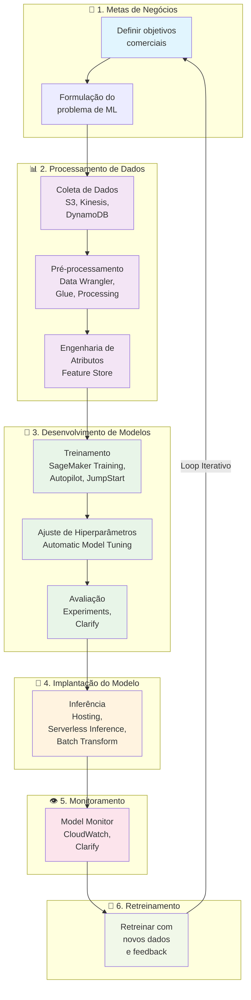
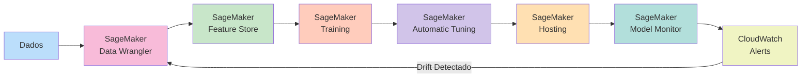

# 🧠 Desenvolvendo Soluções de Machine Learning

| Certificado | Certificado |
| :--- | :---: |
| **Developing Machine Learning Solutions** (AWS) |  |

> **Curso: Developing Machine Learning Solutions | Plano de Estudos AWS AI Practitioner | Nível: Fundamental**

---

## 📖 Visão Geral

O curso **Developing Machine Learning Solutions** aborda o ciclo de vida de machine learning e como usar os serviços da AWS em cada estágio. Você descobrirá os diversos modelos de origem de machine learning e aprenderá técnicas para avaliar o desempenho. Também entenderá a importância das operações de machine learning (MLOps), simplificando o desenvolvimento e a implantação de seus projetos de machine learning.

Este documento é baseado **exclusivamente** na documentação oficial da AWS:
- [AWS Certified AI Practitioner (AIF-C01) Exam Guide](https://d1.awsstatic.com/training-and-certification/docs-ai-practitioner/AWS-Certified-AI-Practitioner_Exam-Guide.pdf)
- [AWS Skill Builder - AI Practitioner Learning Plan](https://explore.skillbuilder.aws/)
- [Amazon SageMaker Documentation](https://docs.aws.amazon.com/sagemaker/)
- [AWS AI Services](https://aws.amazon.com/ai/)

---

## 1. 🔄 Ciclo de Vida de Desenvolvimento de Machine Learning

O ciclo de vida do machine learning (ML) se refere ao processo de ponta a ponta de desenvolvimento, implantação e manutenção de modelos de machine learning.

### Fases do Ciclo de Vida

O processo de ciclo de vida de machine learning de ponta a ponta inclui as seguintes fases:

| # | Fase | Descrição |
|---|------|-----------|
| 1 | **Identificação de Metas de Negócios** | Definir objetivos comerciais claros e alinhados ao problema de ML |
| 2 | **Definição de Problemas de ML** | Traduzir metas de negócios em problemas de ML formuláveis |
| 3 | **Processamento de Dados** | Coleta, pré-processamento e engenharia de atributos |
| 4 | **Desenvolvimento de Modelos** | Treinamento, ajuste e avaliação do modelo |
| 5 | **Implantação do Modelo** | Inferência e previsão em produção |
| 6 | **Monitoramento de Modelos** | Acompanhamento contínuo do desempenho |
| 7 | **Retreinamento de Modelo** | Atualização do modelo com novos dados |

> **Importante:** O ciclo de vida de ML não é linear — é um processo iterativo. Os resultados da avaliação podem levar ao retorno para etapas anteriores.

### Colaboração entre Equipes

À medida que uma empresa segue essas etapas, é necessário ter uma colaboração perfeita entre as diversas funções, como gerentes de produto, desenvolvedores, cientistas de dados e engenheiros. Você aprenderá mais sobre esse conceito na seção MLOps.

---

## 2. 🎯 Caso de Uso: Call Center da Amazon

Há alguns anos, a Amazon precisava melhorar a forma como encaminhava chamadas de atendimento ao cliente, então buscou ajuda no machine learning.

### 2.1 Metas de Negócios

O sistema original de roteamento de call center da Amazon funcionava mais ou menos assim. Um cliente ligava e era recebido por um menu: "Pressione 1 para devoluções. Pressione 2 para Kindle. Pressione 3 para…" e assim por diante. O cliente então faria uma seleção e seria enviado a um atendente que seria treinado nas habilidades específicas para ajudar o cliente.

Na fase de formulação de problema do pipeline, a Amazon determinou que o sistema de roteamento vigente era problemático. A Amazon vende muitos tipos de produtos, então a lista de coisas sobre as quais um cliente pode estar ligando é quase infinita. Portanto, se não oferecêssemos a opção certa para um cliente, ele poderia ser enviado a um generalista ou ao especialista errado, que teria que descobrir o que o cliente precisava antes de enviá-lo para o atendente com as habilidades certas.

Para algumas empresas, talvez isso não seja um problema. Para a Amazon, lidar com centenas de milhões de chamadas de clientes por ano era bastante ineficiente. Era muito caro, desperdiçava muito tempo e, pior de tudo, não era uma boa forma de oferecer aos clientes a ajuda necessária.

### 2.2 Formulação do Problema

O problema comercial estava focado em descobrir como encaminhar os clientes aos atendentes com as habilidades certas e, portanto, reduzir as transferências de chamadas.

Para resolver esse problema, precisávamos prever qual habilidade resolveria a chamada de um cliente.

Quando convertido em um problema de machine learning, isso se converteu em identificar padrões nos dados do cliente que poderíamos usar para prever o roteamento preciso do cliente. Com base na formulação deste problema de ML, ficou claro que estávamos lidando com um problema de **classificação multiclasse**.

### 2.3 Coleta e Integração de Dados

Como queríamos basear nossas previsões em dados anteriores de chamadas de atendimento ao cliente, estávamos lidando com o **aprendizado supervisionado**. Eventualmente, treinaríamos nosso modelo com base em dados históricos de clientes que incluíam os rótulos corretos ou as habilidades dos atendentes dos clientes. Então, o modelo poderia fazer suas próprias previsões com base em dados semelhantes no futuro. Por exemplo, prever que uma ligação de um cliente precisava de uma habilidade do Kindle.

Os dados de que precisávamos vieram de respostas a perguntas como: "Quais foram os pedidos recentes do cliente?" "O cliente tinha um Kindle?" "Eles são membros Prime?" As respostas a essas perguntas viraram nossos **atributos**.

### 2.4 Pré-processamento e Visualização de Dados

Depois, passamos para a fase de preparação ou pré-processamento de dados. Essa fase inclui **limpeza e análise exploratória de dados**.

Muito foi feito nesse momento, mas um exemplo de análise de dados foi pensar criticamente sobre os rótulos que estávamos usando. Fizemos algumas perguntas a nós mesmos: "Há algum rótulo que queremos excluir do modelo por algum motivo comercial?" "Existem rótulos que não são totalmente precisos?" "Algum rótulo é semelhante o suficiente para ser combinado?" Encontrar respostas para essas perguntas explorando os dados ajudaria a reduzir o número de atributos usados e simplificaria nosso modelo.

Um exemplo do que descobrimos nesse tipo de análise foi **combinar rótulos** que representavam várias habilidades do Kindle em um rótulo abrangente de habilidades do Kindle. Dessa forma, cada cliente que teve um problema com um Kindle foi encaminhado para um atendente treinado em todos os problemas do Kindle.

A **visualização de dados** foi a próxima etapa, na qual fizemos várias coisas, incluindo uma análise programática, para nos dar uma ideia rápida dos resumos de atributos e rótulos. Isso nos ajudou a entender melhor os dados com os quais estávamos trabalhando. Por exemplo, poderíamos ter descoberto que 40% das chamadas estavam relacionadas a devoluções, 30% estavam relacionadas a assinaturas Prime, 30% estavam relacionadas ao Kindle e assim por diante.

### 2.5 Treinamento do Modelo

Uma grande parte da preparação para o processo de treinamento é primeiro **dividir seus dados** para garantir uma divisão adequada entre seus esforços de treinamento e avaliação.

O objetivo fundamental do ML é **generalizar** além das instâncias de dados usadas para treinar modelos. Convém avaliar seu modelo para estimar a qualidade de suas previsões para os dados nos quais o modelo não foi treinado. No entanto, da mesma maneira que o aprendizado supervisionado, como instâncias futuras têm valores de destino desconhecidos e não é possível verificar a acurácia das previsões para elas, é preciso usar alguns dados conhecidos para prever dados futuros.

Avaliar o modelo com os mesmos dados usados no treinamento **não é bom**, porque recompensa modelos que conseguem "memorizar" dados de treinamento, em vez de generalizar a partir deles.

Uma estratégia comum é dividir todos os dados rotulados disponíveis em subconjuntos de treinamento, validação e teste, geralmente com uma proporção de **80%, 10% e 10%**. (Outra proporção comum é 70%, 15% e 15%.)

### 2.6 Avaliação do Modelo

Depois de ficarmos satisfeitos com a forma como o modelo interagia com dados de teste invisíveis, implantamos o modelo na produção e o monitoramos para garantir que nosso problema comercial estivesse realmente sendo resolvido.

Nosso problema foi baseado na suposição de que a capacidade de prever habilidades com mais precisão reduziria o número de transferências que um cliente experimentou. Isso foi testado após a implantação, e o número de transferências diminuiu, o que resultou em uma experiência muito melhor para o cliente.

### 2.7 Ajuste de Modelo e Engenharia de Atributos

Depois de executar uma tarefa de treinamento, avaliamos o modelo e iniciamos os **ajustes iterativos** do modelo e dos dados.

Por exemplo, fizemos a **otimização de hiperparâmetros**. Ajustamos os parâmetros de aprendizado para controlar se o modelo aprende rápido ou devagar.

Aprender muito rápido significa que o algoritmo nunca alcançará um valor ideal. Aprender muito devagar significa que o algoritmo demora muito e pode nunca convergir para o ideal em um determinado número de etapas.

Depois, passamos para **engenharia de atributos**. Tivemos atributos que respondiam a perguntas como: "Qual foi o pedido mais recente de um cliente?" "Qual foi a hora do pedido mais recente de um cliente?" "O cliente tem um Kindle?" Quando fornecemos esses atributos ao algoritmo de treinamento do modelo, ele aprende apenas exatamente o que mostramos.

### 2.8 Implantação do Modelo

Em seguida, implantamos o modelo. Agora, ele ajuda os clientes a serem direcionados ao atendente correto na primeira vez.

---

## 3. 🛠️ Amazon SageMaker IA

O **Amazon SageMaker IA** é um serviço de ML totalmente gerenciado. Em uma interface visual unificada, você pode executar as seguintes tarefas:

- Coletar e preparar dados.
- Criar e treinar modelos de machine learning.
- Implantar os modelos e monitorar o desempenho das previsões deles.

### 3.1 Etapas do Processo de ML

Você pode usar o Amazon SageMaker IA para realizar todas as etapas, da coleta de dados à implantação do modelo, em um fluxo de trabalho de ML.

### 3.2 Categorias de Recursos do SageMaker IA

O SageMaker IA oferece recursos organizados em seis categorias que cobrem todo o ciclo de vida de desenvolvimento de ML:

| # | Categoria | Recursos Principais | Descrição |
|---|-----------|---------------------|-----------|
| 1 | **Studio** | SageMaker Studio | Interface web unificada para todo o fluxo de trabalho de ML, da preparação de dados ao gerenciamento de modelos |
| 2 | **Coletar, Analisar e Preparar Dados** | Data Wrangler, Feature Store, Processing | Ferramentas low-code/no-code para importar, preparar, transformar e analisar dados |
| 3 | **Treinar e Avaliar Modelos** | Training, Autopilot, Canvas, JumpStart, Experiments, Automatic Model Tuning | Treinamento de modelos com algoritmos integrados ou personalizados, ajuste de hiperparâmetros |
| 4 | **Implantar Modelos** | Hosting, Serverless Inference, Batch Transform | Opções de implantação para inferência em tempo real, serverless e em lote |
| 5 | **Monitorar** | Model Monitor, Clarify, Debugger | Monitoramento contínuo de qualidade de dados, drift e desempenho do modelo |
| 6 | **MLOps** | Model Registry, Pipelines, Feature Store | Automatização e governança de fluxos de trabalho de ML em produção |

### 3.3 Ambientes do SageMaker IA

O **Amazon SageMaker Studio** é a opção recomendada para acessar o SageMaker IA. É uma interface de usuário da web que dá acesso a todos os ambientes e recursos do SageMaker IA.

#### Coletar, Analisar e Preparar Seus Dados

O **Amazon SageMaker Data Wrangler** é uma ferramenta low-code/no-code (LCNC). Ele fornece uma solução completa para importar, preparar, transformar, caracterizar e analisar dados usando uma interface web. Os clientes podem adicionar seus próprios scripts e transformações em Python para personalizar fluxos de trabalho.

Para usuários mais avançados e preparação de dados em grande escala, o **Amazon SageMaker Studio Classic** vem com integração das sessões interativas do Amazon EMR e do AWS Glue para lidar com fluxos de trabalho interativos de preparação de dados e machine learning em grande escala em um caderno do SageMaker Studio Classic.

Por fim, usando a **API SageMaker Processing**, os clientes podem executar scripts e cadernos para processar, transformar e analisar conjuntos de dados. Eles também podem usar várias estruturas de ML, como scikit-learn, MXNet ou PyTorch, enquanto se beneficiam de ambientes de machine learning totalmente gerenciados.

No final dessa etapa, os clientes geralmente acabam com **atributos** para definir o modelo e os dados nos quais esse modelo será treinado.

O **Amazon SageMaker Feature Store** ajuda cientistas de dados, engenheiros de machine learning e usuários gerais a criar, compartilhar e gerenciar atributos para o desenvolvimento de ML.

Os atributos armazenados na loja podem ser recuperados e enriquecidos antes de serem fornecidos aos modelos de ML para inferências.

#### Treinamento e Avaliação de Modelo

O SageMaker IA fornece um recurso de **trabalho de treinamento** para treinar e implantar modelos usando algoritmos integrados ou algoritmos personalizados.

O SageMaker IA inicia as instâncias de computação de ML e usa o código e o conjunto de dados de treinamento para treinar o modelo. Ele salva os artefatos do modelo resultantes em um bucket do **Amazon Simple Storage Service (Amazon S3)**, que pode ser usado posteriormente para inferência.

Os clientes que desejam uma opção de LCNC podem usar o **Amazon SageMaker Canvas**. Com o SageMaker Canvas, eles podem usar o machine learning para gerar previsões sem precisar escrever código.

O **Amazon SageMaker JumpStart** fornece modelos pré-treinados e de código aberto que os clientes podem usar para uma ampla variedade de tipos de problemas.

#### Avaliação de Modelo

Os clientes podem usar o **Amazon SageMaker Experiments** para experimentar várias combinações de dados, algoritmos e parâmetros, ao mesmo tempo em que observam o impacto das mudanças incrementais na acurácia do modelo.

O **ajuste de hiperparâmetros** é uma forma de encontrar a melhor versão dos modelos. O **Amazon SageMaker Automatic Model Tuning** faz isso executando vários trabalhos com diferentes hiperparâmetros em combinação e medindo cada um deles por meio de uma métrica que você escolher.

#### Implantação

Com o SageMaker IA, os clientes podem implantar seus modelos de ML para fazer previsões, também chamadas de **inferência**. O SageMaker IA fornece uma ampla seleção de opções de implantação de modelos e infraestrutura de ML para atender a todas as necessidades de inferência de ML.

#### Monitoramento

Com o **Amazon SageMaker Model Monitor**, os clientes podem observar a qualidade dos modelos de ML do SageMaker em produção. Eles podem configurar o monitoramento contínuo ou o monitoramento dentro do cronograma. O SageMaker Model Monitor ajuda a manter a qualidade do modelo detectando violações dos limites definidos pelo usuário para qualidade de dados, qualidade do modelo, desvio de viés e desvio de atribuição de atributos.

---

## 4. 📊 Representação Visual (Mermaid.js)

### Diagrama do Ciclo de Vida de ML na AWS

### Fluxo de Trabalho de ML com SageMaker IA

---

## 5. 📌 Dicas para a Prova AIF-C01

> *"O ciclo de vida de ML e os serviços do SageMaker são tópicos altamente cobrados no exame"*

### 5.1 Fases do Ciclo de Vida de ML

| Pergunta | Resposta Correta | Erro Comum |
|----------|------------------|------------|
| "Qual é a primeira fase do ciclo de vida de ML?" | Identificação de metas de negócios | Começar direto com coleta de dados |
| "Qual fase divide dados em treino/validação/teste?" | Desenvolvimento de modelos | Pré-processamento de dados |
| "Qual fase detecta degradação do modelo em produção?" | Monitoramento de modelos | Implantação do modelo |
| "Qual fase usa novos dados para atualizar o modelo?" | Retreinamento de modelo | Avaliação do modelo |

### 5.2 Serviços AWS por Fase do Ciclo de Vida

| Fase | Serviço AWS Principal | Dica de Prova |
|------|----------------------|---------------|
| **Coleta de Dados** | Amazon S3, Kinesis, DynamoDB | S3 é armazenamento, Kinesis é streaming |
| **Pré-processamento** | SageMaker Data Wrangler, Glue, Processing | Data Wrangler é LCNC, Glue é ETL |
| **Feature Store** | SageMaker Feature Store | Armazena e compartilha features |
| **Treinamento** | SageMaker Training, Autopilot, JumpStart | Autopilot é automático, Training é customizado |
| **Ajuste de Hiperparâmetros** | SageMaker Automatic Model Tuning | AMT otimiza hiperparâmetros automaticamente |
| **Avaliação** | SageMaker Experiments, Clarify | Experiments compara runs, Clarify detecta bias |
| **Implantação** | SageMaker Hosting, Serverless Inference | Hosting = sempre ativo, Serverless = sob demanda |
| **Monitoramento** | SageMaker Model Monitor | Detecta drift de dados e degradação |
| **MLOps** | SageMaker Pipelines, Model Registry | Automatiza CI/CD para ML |

### 5.3 Divisão de Dados: Treino/Validação/Teste

- **Proporção comum:** 80% treino, 10% validação, 10% teste (ou 70/15/15)
- **Treino:** Usado para ajustar os pesos do modelo
- **Validação:** Usado para ajustar hiperparâmetros e selecionar o melhor modelo
- **Teste:** Usado para avaliação final, simulando dados nunca vistos
- **Pegadinha:** Nunca avalie o modelo com os mesmos dados de treinamento — isso leva a **overfitting** (memorização)

### 5.4 Tipos de Problemas de ML

| Tipo de Problema | Característica | Exemplo |
|------------------|----------------|---------|
| **Classificação** | Saída é uma categoria discreta | Prever habilidade do atendente (Kindle, devoluções, Prime) |
| **Classificação Multiclasse** | Mais de duas classes | Roteamento de chamadas para N atendentes |
| **Regressão** | Saída é um valor contínuo | Prever preço de um produto |
| **Clustering** | Dados não rotulados, encontrar padrões | Segmentação de clientes |

### 5.5 MLOps — Operações de Machine Learning

- **MLOps** é a prática de unir ML e operações (DevOps) para automatizar e orquestrar pipelines de ML
- **Objetivo:** Facilitar o desenvolvimento e a implantação de projetos de ML em produção
- **Serviços AWS:** SageMaker Pipelines, SageMaker Model Registry, SageMaker Feature Store

### 5.6 Checklist de Revisão Final

- [ ] Entendi as 7 fases do ciclo de vida de ML
- [ ] Sei diferenciar classificação, regressão e clustering
- [ ] Entendo a importância da divisão treino/validação/teste
- [ ] Sei mapear serviços AWS para cada fase do ciclo de vida
- [ ] Entendo o conceito de MLOps e sua importância
- [ ] Sei diferenciar SageMaker Training vs. Autopilot vs. JumpStart
- [ ] Entendo o conceito de overfitting vs. underfitting
- [ ] Sei o que é classificação multiclasse

---

## 🔗 Referências Oficiais

- **AWS Certified AI Practitioner (AIF-C01) Exam Guide**: https://d1.awsstatic.com/training-and-certification/docs-ai-practitioner/AWS-Certified-AI-Practitioner_Exam-Guide.pdf
- **AWS Skill Builder - AI Practitioner Learning Plan**: https://explore.skillbuilder.aws/
- **📄 Certificado do Curso (PDF)**: [Developing Machine Learning Solutions](./docs/Developing%20Machine%20Learning%20Solutions.pdf)
- **Amazon SageMaker Documentation**: https://docs.aws.amazon.com/sagemaker/
- **Amazon SageMaker AI**: https://aws.amazon.com/sagemaker/ai/
- **AWS AI Services**: https://aws.amazon.com/ai/
- **AWS Well-Architected Framework**: https://aws.amazon.com/architecture/well-architected/

---

> **Regra de Ouro**: Todo conteúdo neste repositório é baseado na documentação oficial da AWS. As dicas de prova são compiladas de fontes confiáveis e atualizadas, mas sempre cross-reference com o **Exam Guide oficial da AWS** para a informação mais current.