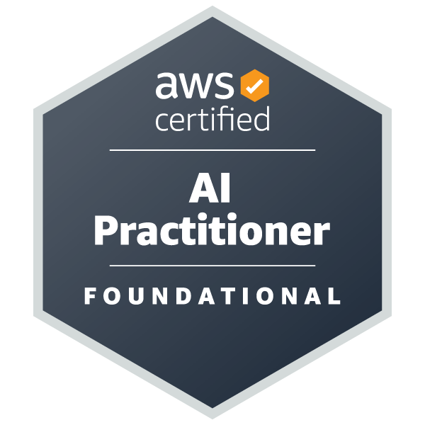

# 🎓 AWS Certified AI Practitioner — Documentos e Certificação

Esta pasta contém os documentos oficiais de comprovação da certificação **AWS Certified AI Practitioner (AIF-C01)**:

---

## 🏅 Distintivo Oficial (Badge)

  

  

---

## 📋 Detalhes da Certificação

| Item | Informação |
|------|------------|
| **Profissional** | João Victor Póvoa França |
| **Certificação** | AWS Certified AI Practitioner |
| **Nível** | Foundational |
| **Código do Exame** | AIF-C01 |
| **Emissão** | 27 de Setembro de 2026 |
| **Validade** | 27 de Setembro de 2029 |
| **ID de Validação AWS** | `da4f38e0ebc946e895537f4f07738920` |
| **Verificação AWS** | [aws.amazon.com/verification](https://aws.amazon.com/verification) |
| **Verificação Credly** | [Credly Public Badge URL](https://www.credly.com/badges/2e01b055-6c45-40a6-adcb-0f17328ed345/public_url) |

---

## 📁 Arquivos no Diretório

- **[`AWS Certified AI Practitioner certificate.pdf`](./AWS%20Certified%20AI%20Practitioner%20certificate.pdf)**: Certificado digital oficial emitido pela AWS Training and Certification.
- **[`aws-certified-ai-practitioner.png`](./aws-certified-ai-practitioner.png)**: Imagem do badge oficial em alta resolução.
