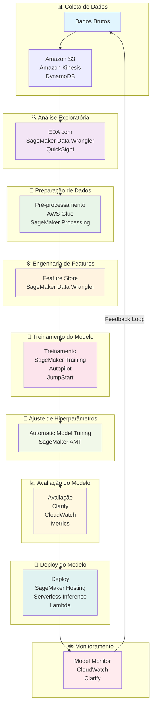
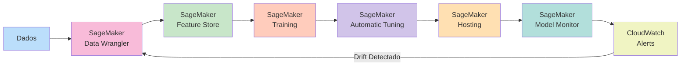

# 🤖 Fundamentos de Machine Learning e Inteligência Artificial

> **Curso: Fundamentals of Machine Learning and Artificial Intelligence | Plano de Estudos AWS AI Practitioner | Nível: Fundamental**

---

## 📖 Visão Geral

O curso **Fundamentals of Machine Learning and Artificial Intelligence** é o primeiro módulo do **Plano de Estudos AWS Artificial Intelligence Practitioner**. Ele fornece uma introdução abrangente aos conceitos fundamentais de IA e ML, diferenciando claramente Inteligidade Artificial (IA), Machine Learning (ML) e Deep Learning (DL), e apresentando o ciclo de vida completo de um projeto de ML na AWS.

Este documento é baseado **exclusivamente** na documentação oficial da AWS:
- [AWS Certified AI Practitioner (AIF-C01) Exam Guide](https://d1.awsstatic.com/training-and-certification/docs-ai-practitioner/AWS-Certified-AI-Practitioner_Exam-Guide.pdf) ([PDF local](./docs/aif-c01-exam-guide.pdf))
- [AWS Technical Essentials](https://d1.awsstatic.com/training-and-certification/classroom-training/aws-technical-essentials.pdf) ([PDF local](./docs/aws-technical-essentials.pdf))
- [AWS Skill Builder - AI Practitioner Learning Plan](https://explore.skillbuilder.aws/)

---

## 1. 🎯 Visão Geral e Conceitos-Chave

### 1.1 Hierarquia: IA vs. ML vs. DL

A relação entre estes conceitos forma uma **hierarquia aninhada**, onde cada nível é um subconjunto do anterior:

```
┌─────────────────────────────────────────────────────────────┐
│                    INTELIGÊNCIA ARTIFICIAL (IA)              │
│                   (Artificial Intelligence)                   │
│  ┌─────────────────────────────────────────────────────────┐ │
│  │              MACHINE LEARNING (ML)                      │ │
│  │                                                         │ │
│  │  ┌─────────────────────────────────────────────────────┐ │ │
│  │  │         DEEP LEARNING (DL)                          │ │ │
│  │  │         (Neural Networks)                           │ │ │
│  │  └─────────────────────────────────────────────────────┘ │ │
│  └─────────────────────────────────────────────────────────┘ │
└─────────────────────────────────────────────────────────────┘
```

| Conceito | Definição | Escopo | Exemplo |
|----------|-----------|--------|---------|
| **IA (Artificial Intelligence)** | Simulação de inteligência humana por máquinas | Mais amplo — inclui qualquer técnica que faça uma máquina "pensar" | Chatbots, robôs autônomos, jogos de xadrez |
| **ML (Machine Learning)** | Subconjunto da IA onde máquinas aprendem padrões a partir de dados, sem serem explicitamente programadas | Intermediário — algoritmos que aprecem com dados | Detecção de spam, previsão de preços, recomendações |
| **DL (Deep Learning)** | Subconjunto do ML que usa redes neurais profundas (multiplas camadas) | Mais específico — redes neurais com muitas camadas | Reconhecimento de imagem, tradução automática, voz |

### 1.2 Diferenciação Prática

| Característica | IA Tradicional (Rules-Based) | Machine Learning | Deep Learning |
|----------------|------------------------------|------------------|---------------|
| **Como funciona** | Regras explícitas programadas por humanos | Aprende padrões a partir de dados | Aprende representações hierárquicas complexas |
| **Manutenção** | Alta — regras precisam ser atualizadas manualmente | Moderada — precisa de novos dados | Baixa — auto-ajusta representações |
| **Escalabilidade** | Baixa — regras se tornam complexas | Alta | Muito alta |
| **Dados necessários** | Nenhum | Médio a grande quantidade | Grande quantidade |
| **Interpretabilidade** | Alta — regras são explícitas | Moderada | Baixa — "caixa preta" |
| **Exemplo de uso** | Sistema de recomendação baseado em regras fixas | Sistema de recomendação baseado em comportamento | Sistema de recomendação com embeddings neurais |

### 1.3 Tipos de Dados: Estruturados vs. Não Estruturados

#### Dados Estruturados
- **Definição:** Dados organizados em formato tabular com esquema definido (linhas e colunas)
- **Características:** Facilmente consultáveis, validáveis e processáveis por algoritmos tradicionais
- **Exemplos:**
  - Tabelas de banco de dados (SQL)
  - Planilhas (CSV, Excel)
  - Dados tabulares de transações financeiras
  - Dados de sensores em formato CSV

#### Dados Não Estruturados
- **Definição:** Dados sem formato ou esquema predefinido, representando a maior parte dos dados do mundo real
- **Características:** Requerem técnicas avançadas de processamento (NLP, visão computacional)
- **Exemplos:**
  - Texto (e-mails, redes sociais, documentos)
  - Imagens (fotos, radiografias, satélites)
  - Áudio (gravações, podcasts, comandos de voz)
  - Vídeo (filmes, transmissões ao vivo)

### 1.4 Tipos de Dados em Modelos de AI

| Tipo de Dados | Descrição | Fonte de Dados | Exemplo de Uso |
|---------------|-----------|----------------|----------------|
| **Tabular** | Dados em formato de tabela (linhas e colunas) | Bancos de dados, CSV | Previsão de churn, scoring de crédito |
| **Time-series** | Dados sequenciais com marcação temporal | Sensores, logs, finanças | Previsão de demanda, monitoramento de infraestrutura |
| **Imagem** | Dados visuais em pixels (2D ou 3D) | Câmeras, satélites, scanners | Detecção de objetos, diagnóstico médico |
| **Texto** | Sequências de caracteres e palavras | E-mails, redes sociais, documentos | Análise de sentimentos, resumo automático |
| **Áudio** | Ondas sonoras digitais | Microfones, gravações | Transcrição, reconhecimento de fala |
| **Rotulado (Labeled)** | Dados com resposta correta conhecida | Anotações humanas | Treinamento de modelos supervisionados |
| **Não rotulado (Unlabeled)** | Dados sem resposta correta | Coleta automática | Clustering, detecção de anomalias |

### 1.5 Tipos de Machine Learning

| Tipo | Descrição | Dados | Objetivo | Algoritmos Exemplos | Caso de Uso |
|------|-----------|-------|----------|---------------------|-------------|
| **Supervisionado** | Aprende mapeando entradas para saídas conhecidas | Rotulado | Prever resultados para novas entradas | Regressão Linear, Random Forest, SVM | Prever preços de imóveis, detecção de spam |
| **Não Supervisionado** | Aprende padrões ocultos sem rótulos | Não rotulado | Descobrir estrutura natural dos dados | K-Means, PCA, DBSCAN | Segmentação de clientes, detecção de anomalias |
| **Reforço** | Aprende por tentativa e erro com recompensas | Ambiente interativo | Maximizar recompensa cumulativa | Q-Learning, Deep Q-Networks | Jogos, robótica, otimização de tráfego |

#### Supervised Learning: Regressão vs. Classificação

| Aspecto | Regressão | Classificação |
|---------|-----------|---------------|
| **Saída** | Valor contínuo (número real) | Categoria discreta (classe) |
| **Exemplo** | Prever temperatura, preço de ações | Detectar spam, diagnosticar doença |
| **Métricas** | MSE, RMSE, MAE | Acurácia, Precisão, Recall, F1 |
| **Algoritmos** | Regressão Linear, Regressão Polinomial | Logistic Regression, Decision Trees, SVM |

---

## 2. 🔄 O Ciclo de Vida de um Projeto de ML

O desenvolvimento de soluções de Machine Learning não é um processo linear, mas um ciclo iterativo. Cada etapa alimenta a próxima, e os resultados da avaliação podem levar ao retorno para etapas anteriores.

### Etapas do Ciclo de Vida

#### 2.1 Coleta de Dados (Data Collection)
- **Objetivo:** Obter dados relevantes que representem o problema a ser resolvido
- **Fontes:** Bancos de dados, APIs, dispositivos IoT, web scraping, dados públicos
- **AWS Services:** Amazon S3, AWS Data Pipeline, Amazon Kinesis, Amazon DynamoDB
- **Considerações:** Volume, variedade, velocidade, veracidade, integridade

#### 2.2 Análise Exploratória de Dados (EDA - Exploratory Data Analysis)
- **Objetivo:** Entender a estrutura, padrões e anomalias nos dados
- **Atividades:** Estatísticas descritivas, visualizações, correlações, detecção de outliers
- **AWS Services:** Amazon SageMaker Data Wrangler, Amazon QuickSight, Amazon Athena
- **Ferramentas:** Pandas, Matplotlib, Seaborn, Jupyter Notebooks

#### 2.3 Preparação e Pré-processamento de Dados (Data Pre-processing)
- **Objetivo:** Limpar e transformar dados brutos em formato adequado para modelagem
- **Atividades:** Tratamento de valores ausentes, remoção de duplicatas, normalização, codificação de variáveis categóricas
- **AWS Services:** Amazon SageMaker Data Wrangler, AWS Glue, Amazon SageMaker Processing
- **Técnicas:** Imputação, One-Hot Encoding, Standard Scaling, Label Encoding

#### 2.4 Engenharia de Features (Feature Engineering)
- **Objetivo:** Criar features significativas que melhorem o desempenho do modelo
- **Atividades:** Extração de features, transformações, seleção de features, criação de interações
- **AWS Services:** Amazon SageMaker Feature Store, Amazon SageMaker Data Wrangler
- **Técnicas:** Feature extraction, feature selection (mutual information, chi-square), PCA

#### 2.5 Treinamento do Modelo (Model Training)
- **Objetivo:** Ajustar o modelo aos dados de treinamento para aprender padrões
- **Atividades:** Escolha do algoritmo, divisão treino/validação/teste, treinamento do modelo
- **AWS Services:** Amazon SageMaker Training, Amazon SageMaker Autopilot, Amazon SageMaker JumpStart
- **Considerações:** Overfitting vs. underfitting, cross-validation, regularização

#### 2.6 Ajuste de Hiperparâmetros (Hyperparameter Tuning)
- **Objetivo:** Otimizar os hiperparâmetros do modelo para melhorar o desempenho
- **Atividades:** Busca em grade (grid search), busca aleatória (random search), otimização bayesiana
- **AWS Services:** Amazon SageMaker Automatic Model Tuning (AMT)
- **Hiperparâmetros comuns:** Learning rate, batch size, número de epochs, profundidade da rede

#### 2.7 Avaliação do Modelo (Model Evaluation)
- **Objetivo:** Medir o desempenho do modelo usando métricas apropriadas
- **Atividades:** Cálculo de métricas, análise de curvas ROC, matriz de confusão, validação cruzada
- **AWS Services:** Amazon SageMaker Model Monitor, Amazon SageMaker Clarify
- **Métricas:** Acurácia, Precisão, Recall, F1-Score, AUC-ROC, MSE, RMSE

#### 2.8 Deploy do Modelo (Model Deployment)
- **Objetivo:** Implantar o modelo em produção para gerar previsões
- **Atividades:** Empacotamento do modelo, configuração de endpoint, testes de carga
- **AWS Services:** Amazon SageMaker Hosting, Amazon SageMaker Serverless Inference, AWS Lambda, Amazon EC2
- **Estratégias:** Blue/Green deployment, canary deployment, A/B testing

#### 2.9 Monitoramento do Modelo (Model Monitoring)
- **Objetivo:** Monitorar o desempenho do modelo em produção e detectar degradação
- **Atividades:** Monitoramento de métricas, detecção de drift de dados, alertas
- **AWS Services:** Amazon SageMaker Model Monitor, Amazon CloudWatch, Amazon SageMaker Clarify
- **Conceitos:** Data drift, concept drift, feature drift

### 2.10 Fontes de Modelos

| Fonte | Descrição | Vantagens | Desvantagens |
|-------|-----------|-----------|--------------|
| **Modelos pré-treinados (open source)** | Modelos já treinados disponíveis publicamente | Rápido para começar, não requer dados grandes | Pode não se adequar ao domínio específico |
| **Treinamento customizado** | Modelos treinados com dados específicos do problema | Alto desempenho no domínio alvo | Requer dados, tempo e expertise |

### 2.11 Métodos de Uso de Modelos em Produção

| Método | Descrição | Vantagens | Desvantagens |
|--------|-----------|-----------|--------------|
| **Managed API Service** | Serviço gerenciado que expõe o modelo como API | Sem gestão de infraestrutura, escala automática | Menos controle, custo por chamada |
| **Self-hosted API** | Modelo implantado em infraestrutura gerenciada pelo cliente | Controle total, custo otimizado | Requer gestão de infraestrutura |

---

## 3. 📊 Representação Visual (Mermaid.js)

### Diagrama do Ciclo de Vida de ML na AWS



### Fluxo de Trabalho de ML com SageMaker



---

## 4. 📋 Casos de Uso e Trade-offs

### 4.1 IA vs. Sistemas Baseados em Regras

| Critério | Sistema Baseado em Regras | Machine Learning |
|----------|---------------------------|------------------|
| **Desenvolvimento** | Regras escritas manualmente por especialistas | Treinado com dados históricos |
| **Manutenção** | Alto esforço — regras precisam ser atualizadas | Moderado — requer novos dados |
| **Adaptabilidade** | Baixa — não se adapta a padrões não previstos | Alta — aprende novos padrões |
| **Interpretabilidade** | Alta — regras são explícitas | Baixa a moderada — "caixa preta" |
| **Custo inicial** | Baixo para problemas simples | Alto — requer dados e expertise |
| **Escalabilidade** | Baixa — regras se tornam complexas | Alta |
| **Quando usar** | Problemas bem definidos, regras claras | Problemas complexos, padrões sutis |

### 4.2 Tipos de ML: Comparação

| Aspecto | Supervisionado | Não Supervisionado | Reforço |
|---------|----------------|---------------------|---------|
| **Dados necessários** | Rotulados | Não rotulados | Ambiente interativo |
| **Objetivo** | Prever saída conhecida | Descobrir padrões | Maximizar recompensa |
| **Métricas** | Acurácia, F1, MSE | Silhouette, Inércia | Recompensa cumulativa |
| **Algoritmos** | Regressão, SVM, Random Forest | K-Means, PCA, DBSCAN | Q-Learning, DQN |
| **Casos de uso** | Classificação, previsão | Segmentação, detecção | Jogos, robótica |

### 4.3 Serviços AWS por Caso de Uso

| Caso de Uso | Serviço AWS | Descrição |
|-------------|-------------|-----------|
| **Visão Computacional** | Amazon Rekognition | Análise de imagens e vídeos (detecção de objetos, rostos, texto) |
| **Processamento de Linguagem Natural** | Amazon Comprehend | Análise de sentimentos, extração de entidades, resumo |
| **Tradução Automática** | Amazon Translate | Tradução entre 75+ idiomas |
| **Síntese de Fala** | Amazon Polly | Converte texto em fala realista |
| **Reconhecimento de Fala** | Amazon Transcribe | Converte fala em texto |
| **Chatbots** | Amazon Lex | Cria bots conversacionais |
| **Treinamento de Modelos Customizados** | Amazon SageMaker | Plataforma completa para desenvolvimento de ML |
| **Recomendações** | Amazon Personalize | Sistema de recomendação personalizado |
| **Detecção de Anomalias** | Amazon Lookout for Metrics | Detecção de anomalias em métricas de negócio |

### 4.4 RAG vs. Fine-tuning vs. Prompt Engineering

| Critério | RAG (Retrieval Augmented Generation) | Fine-tuning | Prompt Engineering |
|----------|-------------------------------------|-------------|---------------------|
| **Como funciona** | Recupera informações externas e as injeta no prompt | Ajusta pesos do modelo com novos dados | Projetar prompts eficazes |
| **Dados necessários** | Base de conhecimento externa | Dados rotulados para treinamento | Nenhum |
| **Custo** | Moderado (infraestrutura de recuperação) | Alto (computação para treinamento) | Baixo |
| **Latência** | Moderada (recuperação + geração) | Baixa (após treinamento) | Baixa |
| **Atualizações** | Fácil — atualizar a base de conhecimento | Difícil — requer re-treinamento | Fácil — modificar prompts |
| **Quando usar** | Conhecimento dinâmico, factual | Domínio específico, estilo personalizado | Prototipagem rápida |

---

## 5. 📌 Exam Tips (Dicas para a Prova AIF-C01)

> *"As principais pegadinhas e conceitos cobrados pela banca sobre os fundamentos de ML"*

### 5.1 Pegadinhas de Terminologia

#### IA vs. ML vs. DL
- **Pergunta comum:** "Qual é a relação entre IA, ML e DL?"
- **Pegadinha:** A banca pode perguntar qual é o "mais específico" ou "mais amplo"
- **Dica:** Lembre-se da hierarquia: **IA ⊃ ML ⊃ DL** (IA é o maior círculo, DL é o menor)

#### Inference vs. Training
- **Pergunta comum:** "Qual é a diferença entre treinar e inferir?"
- **Pegadinha:** A banca pode confundir "inferência" com "inferir" (como em estatística)
- **Dica:** **Training** = construir o modelo. **Inference** = usar o modelo para prever.

### 5.2 Tipos de Dados

#### Estruturados vs. Não Estruturados
- **Pergunta comum:** "Quais são exemplos de dados estruturados?"
- **Pegadinha:** A banca pode incluir dados tabulares como "não estruturados" ou imagens como "estruturadas"
- **Dica:** **Estruturados** = formato tabular definido (CSV, SQL). **Não estruturados** = texto, imagem, áudio, vídeo.

#### Labeled vs. Unlabeled
- **Pergunta comum:** "Qual tipo de dados é necessário para supervised learning?"
- **Pegadinha:** A banca pode perguntar sobre dados "semi-rotulados"
- **Dica:** **Supervisionado** requer dados **rotulados**. **Não supervisionado** usa dados **não rotulados**.

### 5.3 Tipos de Machine Learning

#### Supervised Learning
- **Pergunta comum:** "Qual tipo de ML é usado para prever valores contínuos?"
- **Pegadinha:** A banca pode confundir "regressão" com "classificação"
- **Dica:** **Regressão** = valores contínuos (prever preço). **Classificação** = categorias (spam/não-spam).

#### Unsupervised Learning
- **Pergunta comum:** "Qual técnica é usada para segmentar clientes?"
- **Pegadinha:** A banca pode sugerir que "anomaly detection" é supervisionado
- **Dica:** **Clustering** (K-Means) e **anomaly detection** são **não supervisionados**.

#### Reinforcement Learning
- **Pergunta comum:** "Qual tipo de ML usa recompensas?"
- **Pegadinha:** A banca pode confundir RL com supervised learning
- **Dica:** RL = **tentativa e erro com recompensas**. Usado em jogos, robótica.

### 5.4 Serviços AWS — Mapeamento Caso de Uso

| Pergunta | Resposta Correta | Erro Comum |
|----------|------------------|------------|
| "Analisar sentimentos em textos" | Amazon Comprehend | Amazon Translate |
| "Converter fala em texto" | Amazon Transcribe | Amazon Polly |
| "Converter texto em fala" | Amazon Polly | Amazon Transcribe |
| "Traduzir idiomas" | Amazon Translate | Amazon Comprehend |
| "Reconhecer objetos em imagens" | Amazon Rekognition | Amazon Comprehend |
| "Criar chatbots" | Amazon Lex | Amazon Polly |
| "Treinar modelos customizados" | Amazon SageMaker | Amazon Rekognition |

### 5.5 Ciclo de Vida de ML — Etapas e Serviços

| Etapa | Serviço AWS Principal | Dica de Prova |
|-------|----------------------|---------------|
| **Coleta de Dados** | Amazon S3, Kinesis | S3 é armazenamento, Kinesis é streaming |
| **EDA** | SageMaker Data Wrangler | Data Wrangler é para análise exploratória |
| **Pré-processamento** | SageMaker Processing, AWS Glue | Glue é ETL, Processing é para ML |
| **Feature Store** | SageMaker Feature Store | Armazena features para reutilização |
| **Treinamento** | SageMaker Training, Autopilot | Autopilot é automático, Training é customizado |
| **Hyperparameter Tuning** | SageMaker Automatic Model Tuning | AMT otimiza hiperparâmetros automaticamente |
| **Avaliação** | SageMaker Clarify, Model Monitor | Clarify detecta bias, Monitor monitora drift |
| **Deploy** | SageMaker Hosting, Serverless Inference | Hosting = sempre ativo, Serverless = sob demanda |
| **Monitoramento** | SageMaker Model Monitor | Detecta drift de dados e degradação |

### 5.6 Conceitos de Prova Alta Prioridade

#### Bias, Fairness e Hallucinations
- **Bias:** Erro sistemático devido a dados de treinamento enviesados
- **Fairness:** Garantir que o modelo não discrimine grupos
- **Hallucinations:** Quando LLMs geram informações falsas
- **Dica:** Para mitigar hallucinations, use **RAG**, **temperature baixa**, **instruções explícitas**

#### RAG (Retrieval Augmented Generation)
- **Fluxo:** Documentos → Chunking → Embedding → Vector Store → Query → Retrieval → Prompt → Generation
- **Serviços AWS:** Bedrock Knowledge Bases, OpenSearch Serverless, SageMaker
- **Dica:** RAG é a resposta para "como manter o modelo atualizado com informações recentes"

#### Foundation Models (FMs) vs. Task-Specific Models
- **FMs:** Grandes modelos pré-treinados (ex: Claude, Llama, Titan)
- **Task-Specific:** Modelos treinados para uma tarefa específica
- **Dica:** FMs são mais versáteis, task-specific são mais precisos para domínios específicos

### 5.7 Checklist de Revisão Final

- [ ] Diferenciei IA, ML e DL com clareza
- [ ] Sei diferenciar dados estruturados vs. não estruturados
- [ ] Entendo supervised, unsupervised e reinforcement learning
- [ ] Sei mapear casos de uso para serviços AWS corretos
- [ ] Entendo o ciclo de vida de ML e serviços para cada etapa
- [ ] Diferenciei inference vs. training
- [ ] Entendo conceitos de bias, fairness e hallucinations
- [ ] Conheço o fluxo de RAG
- [ ] Diferenciei RAG vs. Fine-tuning vs. Prompt Engineering
- [ ] Pratiquei questões de múltipla resposta (sem pontuação parcial)

---

## 🔗 Referências Oficiais

- **AWS Certified AI Practitioner (AIF-C01) Exam Guide**: https://d1.awsstatic.com/training-and-certification/docs-ai-practitioner/AWS-Certified-AI-Practitioner_Exam-Guide.pdf ([PDF local](./docs/aif-c01-exam-guide.pdf))
- **AWS Technical Essentials**: https://d1.awsstatic.com/training-and-certification/classroom-training/aws-technical-essentials.pdf ([PDF local](./docs/aws-technical-essentials.pdf))
- **AWS Skill Builder - AI Practitioner Learning Plan**: https://explore.skillbuilder.aws/
- **Amazon SageMaker Documentation**: https://docs.aws.amazon.com/sagemaker/
- **AWS AI Services**: https://aws.amazon.com/ai/
- **AWS Well-Architected Framework**: https://aws.amazon.com/architecture/well-architected/

---

> **Regra de Ouro**: Todo conteúdo neste repositório é baseado na documentação oficial da AWS. As dicas de prova são compiladas de fontes confiáveis e atualizadas, mas sempre cross-reference com o **Exam Guide oficial da AWS** para a informação mais current.
