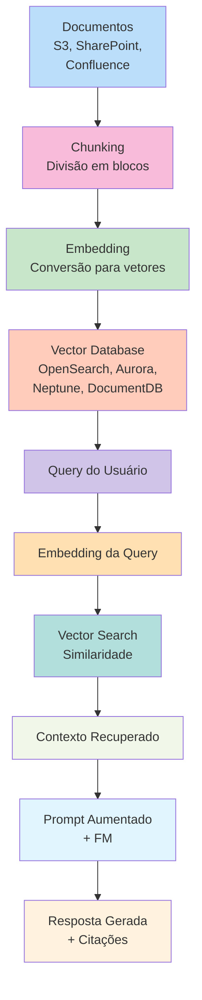
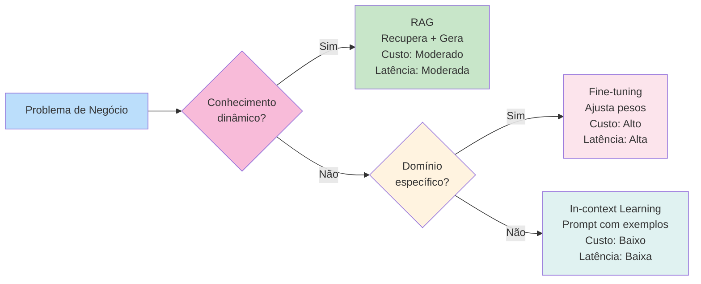
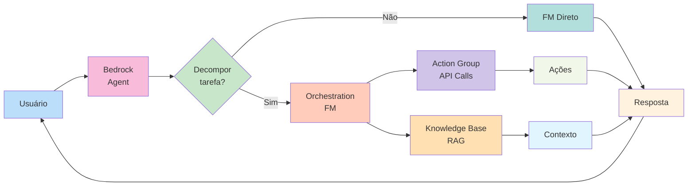
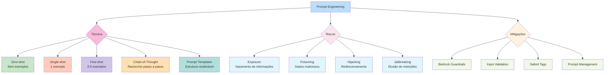

# 🎯 Aplicações de Modelos de Base (Optimizing Foundation Models)

| Certificado | Certificado |
| :--- | :---: |
| **Optimizing Foundation Models** (AWS) | [](https://github.com/JoaoIto/aws-skills/blob/main/aws-ai-practitioner/optimizing-foundation-models/docs/Optimizing-Foundation-Models.pdf) |

> **Curso: Optimizing Foundation Models | Plano de Estudos AWS AI Practitioner | Nível: Fundamental**

---

## 📖 Visão Geral

O curso **Optimizing Foundation Models** é o sexto módulo do **Plano de Estudos AWS Artificial Intelligence Practitioner**. Neste módulo, você explorará duas técnicas fundamentais para melhorar o desempenho de um modelo de base (FM): **geração aumentada via recuperação (RAG)** e **ajuste fino (fine-tuning)**.

Você aprenderá sobre os serviços da AWS que ajudam a armazenar incorporações com bancos de dados de vetores, a função dos agentes em tarefas de várias etapas, como definir métodos para ajustar um FM, como preparar dados para ajuste fino e muito mais.

Este documento é baseado **exclusivamente** na documentação oficial da AWS:
- [AWS Certified AI Practitioner (AIF-C01) Exam Guide](https://d1.awsstatic.com/training-and-certification/docs-ai-practitioner/AWS-Certified-AI-Practitioner_Exam-Guide.pdf)
- [AWS Certification - Domain 3: Applications of Foundation Models](https://docs.aws.amazon.com/aws-certification/latest/ai-practitioner-01/ai-practitioner-01-domain3.html)
- [AWS Skill Builder - AI Practitioner Learning Plan](https://explore.skillbuilder.aws/)
- [Amazon Bedrock Documentation](https://docs.aws.amazon.com/bedrock/)
- [Amazon SageMaker Documentation](https://docs.aws.amazon.com/sagemaker/)
- [AWS Prescriptive Guidance - RAG](https://docs.aws.amazon.com/prescriptive-guidance/latest/retrieval-augmented-generation-options/)
- [AWS Prescriptive Guidance - Prompt Engineering](https://docs.aws.amazon.com/prescriptive-guidance/latest/llm-prompt-engineering-best-practices/)
- [AWS AI Services](https://aws.amazon.com/ai/)

---

## 📊 Peso no Exame AIF-C01

| Domínio | Peso | Task Statements |
|---------|------|-----------------|
| **Domain 3: Applications of Foundation Models** | **28%** | 3.1, 3.2, 3.3, 3.4 |

---

## 1. 🎯 Considerações de Design para Aplicações com Modelos de Base (FMs)

> **Task Statement 3.1:** Describe design considerations for applications that use foundation models.

### 1.1 Critérios de Seleção de Modelos Pré-treinados

Ao escolher um modelo de base (FM) pré-treinado, você deve avaliar diversos fatores para garantir que o modelo atenda às necessidades específicas do seu caso de uso:

| Critério | Descrição | Considerações |
|----------|-----------|---------------|
| **Cost** | Custo de inferência e customização | Modelos maiores custam mais por token; fine-tuning tem custo adicional de treinamento |
| **Modality** | Tipo de dados suportados (texto, imagem, áudio, vídeo) | Verifique se o modelo suporta a modalidade necessária (ex: texto+imagem para multimodal) |
| **Latency** | Tempo de resposta | Modelos maiores têm maior latência; use modelos menores para aplicações em tempo real |
| **Multi-lingual** | Suporte a múltiplos idiomas | Verifique o suporte a idiomas específicos (ex: português, mandarim, etc.) |
| **Model size** | Número de parâmetros | Modelos maiores têm maior capacidade, mas maior custo e latência |
| **Model complexity** | Arquitetura e capacidades | LLMs, modelos multimodais, modelos especializados (código, imagem) |
| **Customization** | Capacidade de personalização | In-context learning, fine-tuning, RAG — verifique quais métodos são suportados |
| **Input/Output length** | Janela de contexto (context window) | Determina quanto texto pode ser processado em uma única chamada |
| **Prompt caching** | Cache de prompts para reduzir custos | Reutilização de embeddings de prompts repetidos para otimização de custo |

### 1.2 Parâmetros de Inferência

Os parâmetros de inferência controlam como o modelo gera respostas. Eles são críticos para equilibrar **criatividade** vs. **determinismo**:

| Parâmetro | Faixa | Efeito | Uso Recomendado |
|-----------|-------|--------|-----------------|
| **Temperature** | 0.0 – 1.0 | Controla a aleatoriedade das saídas. Valores baixos = mais determinístico; valores altos = mais criativo | **Baixo (0-0.3):** Respostas fáticas, sumarização, Q&A. **Alto (0.7-1.0):** Brainstorming, escrita criativa |
| **Max tokens (output length)** | 1 – 4096+ | Limita o número de tokens na resposta gerada | Controla o tamanho da saída; evita respostas excessivamente longas |
| **Top-p (nucleus sampling)** | 0.0 – 1.0 | Considera apenas os tokens mais prováveis (top P% da distribuição cumulativa) | **Baixo (0.1-0.5):** Respostas focadas e determinísticas. **Alto (0.8-1.0):** Mais diversidade |
| **Top-k** | 1 – 500 | Limita a escolha aos K tokens mais prováveis | Reduz a aleatoriedade; útil para respostas mais previsíveis |

> **Dica de Prova:** Temperature = 0 para respostas determinísticas e fáticas. Temperature alta para criatividade. Top-p e Top-k são técnicas de *nucleus sampling* e *k-sampling* para controlar a diversidade.

### 1.3 Retrieval Augmented Generation (RAG)

#### Definição

**RAG (Retrieval Augmented Generation)** é uma arquitetura que combina **recuperação de informações** (retrieval) com **geração de texto** (generation). Em vez de depender apenas do conhecimento pré-treinado do modelo, o RAG recupera informações relevantes de uma fonte externa (base de conhecimento) e as injeta no prompt antes da geração da resposta.

#### Fluxo de Trabalho do RAG

```
1. Documentos → 2. Chunking → 3. Embedding → 4. Vector Store
     ↓
5. Query → 6. Embedding da Query → 7. Similaridade (Vector Search)
     ↓
8. Contexto Recuperado → 9. Prompt Aumentado → 10. FM Gera Resposta
```

#### Serviços AWS para RAG

| Serviço | Função |
|---------|--------|
| **Amazon Bedrock Knowledge Bases** | Serviço totalmente gerenciado para criar bases de conhecimento e implementar RAG |
| **Amazon Bedrock FMs** | Modelos de base que geram respostas a partir do contexto recuperado |
| **Amazon Bedrock Guardrails** | Filtra conteúdo indesejado e protege contra ataques de prompt |

#### Tipos de Knowledge Bases

| Tipo | Gestão | Vantagens | Desvantagens |
|------|--------|-----------|--------------|
| **Managed Knowledge Base** | AWS gerencia infraestrutura | Setup rápido, ingestão automática, parsing inteligente, integração nativa com AgentCore | Menos controle sobre configurações |
| **Customer-managed Knowledge Base** | Cliente gerencia | Controle total sobre vector store, parsing, indexação | Requer mais configuração e gestão |

#### Fontes de Dados Suportadas

| Fonte | Tipo |
|-------|------|
| **Amazon S3** | Armazenamento de objetos |
| **SharePoint** | Documentos corporativos |
| **Confluence** | Wikis corporativos |
| **Google Drive** | Documentos em nuvem |
| **OneDrive** | Documentos Microsoft |
| **Web Crawler** | Conteúdo web |

#### Recursos Principais do RAG

| Recurso | Descrição |
|---------|-----------|
| **Agentic Retrieval** | Decomposição de queries complexas em sub-queries para multi-hop reasoning |
| **Document-level Permissions** | Filtragem de acesso baseada em ACLs (Access Control Lists) |
| **Multimodal Search** | Busca usando imagens como queries ou combinando texto + imagem |
| **Reranking** | Modelos de reranking para influenciar resultados de recuperação |
| **Citations** | Referências às fontes incluídas nas respostas geradas |

#### Aplicações Comerciais do RAG

- **Chatbots corporativos** — Respostas precisas baseadas em documentação interna
- **Sistemas de Q&A** — Perguntas sobre políticas, procedimentos, manuais
- **Suporte ao cliente** — Respostas fundamentadas em base de conhecimento atualizada
- **Análise de documentos** — Extração e síntese de informações de documentos grandes

> **Dica de Prova:** RAG é a resposta para "como manter o modelo atualizado com informações recentes" e "como reduzir hallucinations". RAG fornece **citações** (source references) e **reduz risco de alucinações**.

### 1.4 Bancos de Dados de Vetores (Vector Databases)

Os bancos de dados de vetores armazenam e recuperam embeddings (representações vetoriais de alta dimensionalidade) para busca semântica. A AWS oferece várias opções:

| Serviço | Tipo | Vector Storage | Indexing | Distance Metrics | Uso Recomendado |
|---------|------|----------------|----------|------------------|-----------------|
| **Amazon OpenSearch Service** | Search & Analytics | Até 16.000 dimensões | HNSW, IVF | Cosine, Euclidean, Dot product | Busca em tempo real, knowledge management RAG, full-text + vector |
| **Amazon Aurora (PostgreSQL + pgvector)** | Relational DB | Via extensão pgvector | IVFFlat, HNSW | Cosine, Euclidean, Inner product | Workloads híbridos SQL + vector, transações ACID |
| **Amazon Neptune Analytics** | Graph Analytics | Suporte nativo a vetores | Graph + Vector indexing | Cosine, Euclidean | GraphRAG, knowledge graphs conectados |
| **Amazon DocumentDB (MongoDB compat.)** | Document DB | Até 2.000 dimensões (indexado) | HNSW, IVFFlat | Cosine, Euclidean, Dot product | Apps existentes com MongoDB APIs |
| **Amazon RDS for PostgreSQL (pgvector)** | Relational DB | Via extensão pgvector | IVFFlat | Cosine, Euclidean, Inner product | SQL + vector search sem gestão de infraestrutura |

> **Dica de Prova:** Para o exame, lembre-se: **OpenSearch** = busca distribuída; **Aurora** = relational com vector; **Neptune** = graph; **DocumentDB** = MongoDB compatível; **RDS PostgreSQL** = pgvector.

### 1.5 Trade-offs de Custo para Customização de FMs

| Método | Como funciona | Custo | Latência | Quando usar |
|--------|---------------|-------|----------|-------------|
| **Pre-training** | Treina o modelo do zero com grandes volumes de dados | Muito alto | Muito alta | Necessidade extrema de customização |
| **Fine-tuning** | Ajusta pesos do modelo com novos dados | Alto | Alta (pós-treinamento) | Domínio específico, estilo personalizado |
| **In-context Learning** | Fornece exemplos no prompt (few-shot) | Baixo | Baixa | Prototipagem rápida, tarefas simples |
| **RAG** | Recupera informações externas e injeta no prompt | Moderado | Moderada | Conhecimento dinâmico, factual |
| **Model Distillation** | Cria um modelo menor baseado em um modelo maior | Alto (treinamento) | Baixa (inferência) | Redução de custo de inferência |

### 1.6 Agentes para Tarefas de Várias Etapas

#### O que são Agentes?

**Agentes de IA** são sistemas que estendem modelos de base (FMs) para **entender solicitações do usuário, decompor tarefas em etapas menores e executar ações** automaticamente. Eles orquestram interações entre FMs, fontes de dados, APIs e conversas com o usuário.

#### Serviços AWS

| Serviço | Descrição |
|---------|-----------|
| **Agents for Amazon Bedrock** | Orquestra tarefas multi-etapas com FMs gerenciados |
| **Amazon Bedrock AgentCore** | Plataforma para construir, implantar e escalar agentes de IA (recomendado para novos clientes) |

#### Como Funciona o Fluxo de Trabalho

1. **(Opcional)** Criar uma knowledge base para dados privados
2. Configurar o agente, adicionando action groups ou associando uma knowledge base
3. **(Opcional)** Personalizar comportamento modificando templates de prompt
4. Testar o agente no console ou via API, usando traces para examinar o raciocínio
5. Criar um alias para implantar uma versão específica do agente
6. Configurar a aplicação para fazer chamadas de API ao alias do agente
7. Iterar com novas versões e aliases

#### Componentes Principais

| Componente | Função |
|------------|--------|
| **Action Groups** | Definem as ações específicas que o agente pode executar via API calls |
| **Knowledge Bases** | Armazenam dados privados para augmentar o conhecimento do agente |
| **Memory** | Gerenciada pelo Bedrock — mantém contexto da conversa |
| **Prompt Templates** | Controlam como o agente processa entrada e gera saída |

#### Casos de Uso Comerciais

- **Processamento de sinistros** — Automatiza a triagem e aprovação de claims
- **Reservas de viagem** — Coordena buscas, reservas e confirmações
- **Suporte técnico** — Diagnóstico e resolução de problemas técnicos

> **Dica de Prova:** Agentes são para **tarefas multi-etapas** que exigem **ações** (API calls) e **raciocínio**. Use "Agents for Amazon Bedrock" para orquestração.

---

## 2. ✍️ Técnicas de Prompt Engineering

> **Task Statement 3.2:** Choose effective prompt engineering techniques.

### 2.1 Conceitos e Construções

| Conceito | Descrição |
|----------|-----------|
| **Context** | Informações de fundo fornecidas ao modelo para contextualizar a tarefa |
| **Instruction** | A diretriz clara sobre o que o modelo deve fazer |
| **Negative Prompts** | Instruções que especificam o que o modelo **não** deve fazer ou gerar |
| **Model Latent Space** | O espaço vetorial de representações internas do modelo onde o significado é capturado |

### 2.2 Técnicas de Prompt Engineering

| Técnica | Como funciona | Exemplo | Uso |
|---------|---------------|---------|-----|
| **Zero-shot** | Nenhum exemplo fornecido — o modelo responde apenas com a instrução | "Classifique: 'Produto excelente!' → Positivo/Negativo" | Tarefas simples, prototipagem |
| **Single-shot** | Um único exemplo fornecido | "Exemplo: 'Bom dia' → Saudação. Agora classifique: 'Produto ruim'" | Tarefas com um padrão claro |
| **Few-shot** | Poucos exemplos (3-5) fornecidos | "Exemplos: 'Ótimo'→Positivo, 'Ruim'→Negativo, 'OK'→Neutro. Classifique: 'Aceitável'" | Tarefas que precisam de calibração |
| **Chain-of-Thought (CoT)** | Incentiva o modelo a raciocinar passo a passo | "Primeiro, identifique o sentimento. Em seguida, justifique. Por fim, classifique." | Tarefas complexas, raciocínio lógico |
| **Prompt Templates** | Estruturas reutilizáveis com variáveis | "Resuma o seguinte texto: {texto}" | Aplicações reutilizáveis, sistemas em produção |

### 2.3 Melhores Práticas

| Prática | Descrição | Exemplo |
|---------|-----------|---------|
| **Specificity** | Seja específico sobre o que deseja | "Resuma em 3 frases" vs. "Resuma" |
| **Concision** | Mantenha instruções claras e diretas | Evite instruções ambíguas ou contraditórias |
| **Guardrails** | Use Bedrock Guardrails para filtrar conteúdo | Protege contra saídas tóxicas ou inadequadas |
| **Experimentation** | Teste diferentes variações de prompts | Use hold-out test sets para validação |
| **Discovery** | Explore o espaço de prompts sistematicamente | A/B testing de templates |
| **Output indicators** | Especifique o formato de saída desejado | "Responda em <nome> e <ano> tags" |
| **Instruction placement** | Coloque a instrução no final do prompt | Melhora a atenção do modelo |
| **Default output** | Forneça uma saída padrão para incertezas | "Se não souber, responda 'Não sei'" |

### 2.4 Estrutura de um Prompt Bem-Desenhado

Um prompt eficaz deve incluir:

1. **Contextual information** — Frase introdutória que estabelece o cenário
2. **Reference text** — O texto principal a ser processado
3. **Clear instructions** — Diretrizes simples, completas e não ambíguas
4. **Output format** — Especificação clara do formato de saída desejado
5. **Instruction at the end** — A pergunta ou tarefa deve aparecer por último

```
Context: Você é um assistente de análise financeira.
Texto: {reference_text}
Instrução: Resuma os pontos principais do texto acima em 3 frases.
Formato de saída: Retorne apenas o resumo, sem formatação adicional.
```

### 2.5 Riscos e Limitações

| Risco | Descrição | Mitigação |
|-------|-----------|-----------|
| **Exposure** | Vazamento de informações sensíveis ou do prompt interno | Use guardrails, não exponha prompts no output |
| **Poisoning** | Inserção de dados maliciosos durante o treinamento | Valide e sanitize dados de treinamento |
| **Hijacking** | Redirecionamento do modelo para comportamentos não autorizados | Guardrails, validação de input |
| **Jailbreaking** | Elusão de restrições de segurança do modelo | Guardrails, detecção de padrões de ataque |
| **Prompt Injection** | Manipulação de inputs para bypassar medidas de segurança | Input validation, Bedrock Guardrails, salted tags |

#### Ataques Comuns de Prompt Injection

| Ataque | Descrição |
|--------|-----------|
| **Prompted persona switches** | Tenta fazer o LLM adotar uma persona maliciosa |
| **Extracting the prompt template** | Pede ao LLM para revelar suas instruções internas |
| **Ignoring the prompt template** | Instrui o LLM a ignorar suas diretrizes |
| **Alternating languages and escape characters** | Usa múltiplos idiomas e caracteres de escape |
| **Extracting conversation history** | Pede ao LLM para imprimir conversas anteriores |
| **Augmenting the prompt template** | Tenta alterar o template do modelo |
| **Fake completion** | Fornece respostas pré-completadas para desviar o modelo |
| **Rephrasing/obfuscating attacks** | Reformula ataques para evitar detecção |
| **Changing output format** | Altera o formato de saída para burlar filtros |
| **Changing input attack format** | Usa formatos não legíveis (ex: base64) |
| **Exploiting friendliness** | Usa linguagem amigável para induzir obediência |

### 2.6 Gerenciamento e Versionamento de Prompts

O **Amazon Bedrock Prompt Management** permite:

| Recurso | Descrição |
|---------|-----------|
| **Create** | Criar prompts reutilizáveis com variáveis |
| **Test** | Testar prompts com valores de variáveis e comparar variantes |
| **Version** | Salvar diferentes versões de prompts durante iterações |
| **Deploy** | Integrar prompts em aplicações usando versões salvas |
| **Optimize** | Refinar prompts para melhor desempenho |

> **Dica de Prova:** Para riscos de prompt engineering, lembre-se: **exposure, poisoning, hijacking, jailbreaking**. Para mitigação: use **Bedrock Guardrails** e **input validation**.

---

## 3. 🔧 Treinamento e Ajuste Fino (Fine-tuning) de FMs

> **Task Statement 3.3:** Describe the training and fine-tuning process for foundation models.

### 3.1 Elementos do Ciclo de Vida de Treinamento

| Elemento | Descrição |
|----------|-----------|
| **Pre-training** | Treinamento em grandes volumes de dados não rotulados para aprender representações gerais |
| **Fine-tuning** | Ajuste do modelo com dados específicos do domínio para melhorar desempenho em tarefas específicas |
| **Continuous pre-training** | Atualização contínua do modelo com novos dados mantendo o conhecimento prévio |
| **Distillation** | Técnica para criar modelos menores e mais eficientes baseados em modelos maiores (teacher-student) |

### 3.2 Métodos de Fine-tuning

| Método | Como funciona | Uso |
|--------|---------------|-----|
| **Instruction Tuning** | Treina o modelo com instruções textuais para melhorar a capacidade de seguir comandos | Tarefas que exigem seguir instruções complexas |
| **Domain Adaptation** | Ajusta o modelo para um domínio específico (ex: jurídico, médico, financeiro) | Domínios com terminologia especializada |
| **Transfer Learning** | Usa conhecimento de um domínio para melhorar desempenho em outro | Quando há poucos dados no domínio alvo |
| **Continuous Pre-training** | Continua o pré-treinamento com novos dados para atualizar conhecimento | Manter o modelo atualizado com informações recentes |

### 3.3 Preparação de Dados para Fine-tuning

#### Formato de Dados

- **Formato:** Arquivos `.jsonl` (JSON Lines), onde cada linha é um objeto JSON representando um registro
- **Armazenamento:** Dados de treinamento e validação são armazenados em um bucket do **Amazon S3**
- **Criptografia:** Dados de entrada e saída podem ser criptografados (opcional)

#### Requisitos de Dados

| Requisito | Descrição |
|-----------|-----------|
| **Data Curation** | Limpeza, formatação e validação dos dados antes do treinamento |
| **Data Governance** | Políticas para garantir qualidade, conformidade e privacidade dos dados |
| **Data Size** | Quantidade suficiente de dados para o modelo aprender padrões significativos (geralmente milhares a milhões de exemplos) |
| **Data Labeling** | Dados devem ser rotulados corretamente para tarefas supervisionadas |
| **Data Representativeness** | Dados devem representar fielmente a distribuição do problema real |
| **RLHF (Reinforcement Learning from Human Feedback)** | Uso de feedback humano para alinhar o modelo com preferências humanas |

#### Processo de Fine-tuning no Amazon Bedrock

1. **Prerequisites:**
   - Criar uma IAM role com acesso ao S3 para dados de treinamento/validação
   - (Opcional) Criptografar dados de entrada/saída
   - (Opcional) Criar uma VPC para proteger o job

2. **Configuração do Job:**
   - Selecionar um modelo base (FM pré-treinado)
   - Configurar hiperparâmetros (epochs, batch size, learning rate)
   - Especificar localização S3 para dados de treinamento e validação
   - Especificar localização S3 para saída (métricas)

3. **Modelos Suportados para Fine-tuning:**

| Provedor | Modelos | Regiões |
|----------|---------|---------|
| **Amazon** | Amazon Nova Pro, Nova Lite, Nova Micro, Nova Canvas, Titan Image Generator | us-east-1, us-west-2 |
| **Anthropic** | Claude 3 Haiku | us-west-2 |
| **Meta** | Llama 3.1, Llama 3.2, Llama 3.3 (várias variantes) | us-west-2 |

> **Dica de Prova:** Fine-tuning requer **dados rotulados**, **S3** para armazenamento, **IAM role** para acesso, e é **custoso** (computação para treinamento). Use quando precisa de **domínio específico** ou **estilo personalizado**.

---

## 4. 📊 Avaliação de Desempenho de Modelos de Base

> **Task Statement 3.4:** Describe methods to evaluate foundation model performance.

### 4.1 Abordagens de Avaliação

| Abordagem | Descrição | Serviço AWS |
|-----------|-----------|-------------|
| **Human-in-the-loop evaluation** | Avaliação manual por humanos para qualidade, alinhamento e segurança | Amazon A2I, Bedrock Model Evaluation |
| **Benchmark datasets** | Conjuntos de dados padronizados para comparação objetiva | Gigaword, GLUE, SuperGLUE |
| **Amazon Bedrock Model Evaluation** | Serviço gerenciado para avaliação automática e humana de modelos | Amazon Bedrock |

### 4.2 Métricas de Avaliação

#### Métricas Automáticas (NLP)

| Métrica | Definição | Como funciona | Uso |
|---------|-----------|---------------|-----|
| **ROUGE (Recall-Oriented Understudy for Gisting Evaluation)** | Mede a sobreposição de N-grams entre o resumo gerado e o resumo de referência | Calcula precisão e recall de N-grams (unigramas, bigramas, LCS) | Avaliação de resumo de texto |
| **BLEU (Bilingual Evaluation Understudy)** | Mede a similaridade entre texto gerado e referência baseado em N-grams | Calcula precisão de N-grams com penalização por frases muito curtas | Avaliação de tradução automática |
| **BERTScore** | Usa um modelo BERT para comparar embeddings de sentenças | Calcula similaridade do cosseno entre embeddings de sentenças | Avaliação mais flexível, captura similaridade semântica |
| **Meteor** | Similar ao ROUGE-1, mas inclui stemming e correspondência de sinônimos | Combina correspondência exata, stemming e sinônimos | Avaliação de tradução e resumo |

#### Métricas LLM-as-a-Judge (Bedrock)

| Métrica | Descrição |
|---------|-----------|
| **Correctness** | Mede se a resposta do modelo está correta (compara com ground truth) |
| **Completeness** | Mede se todas as perguntas do prompt foram respondidas |
| **Faithfulness** | Identifica informações não presentes no contexto (alucinações) |
| **Helpfulness** | Mede a utilidade da resposta (adesão a instruções, coerência) |
| **Coherence** | Mede a coerência lógica da resposta |
| **Relevance** | Mede a relevância da resposta ao prompt |
| **Following Instructions** | Mede o cumprimento das diretrizes do prompt |
| **Professional Style and Tone** | Avalia a adequação do estilo e tom profissional |
| **Harmfulness** | Avalia conteúdo prejudicial na resposta |
| **Stereotyping** | Avalia estereótipos na resposta |
| **Refusal** | Determina se o modelo recusou a responder |

### 4.3 Métricas de Negócio

| Categoria | Métrica | Descrição |
|-----------|---------|-----------|
| **Produtividade** | Tempo de desenvolvimento reduzido | Redução no tempo para criar conteúdo |
| **Engajamento** | User engagement | Nível de interação e uso da aplicação |
| **Eficiência** | Task completion rate | Porcentagem de tarefas concluídas com sucesso |
| **Satisfação** | User satisfaction (NPS) | Satisfação do usuário com a solução |
| **Custo** | Cost per interaction | Custo por interação com o modelo |
| **Qualidade** | Accuracy, ROUGE, BERTScore | Precisão e qualidade do conteúdo gerado |

### 4.4 Avaliação de Aplicações com FMs

| Tipo de Aplicação | Métricas de Avaliação |
|-------------------|----------------------|
| **RAG** | Precisão da recuperação, relevância do contexto, qualidade da resposta, citações corretas |
| **Agents** | Taxa de conclusão de tarefas, número de etapas, precisão das ações |
| **Workflows** | Latência total, throughput, taxa de erro |

> **Dica de Prova:** Para avaliação de FMs, lembre-se: **ROUGE** = resumo, **BLEU** = tradução, **BERTScore** = similaridade semântica. **Human evaluation** e **benchmark datasets** são abordagens complementares.

---

## 5. 📊 Representação Visual (Mermaid.js)

### 5.1 Fluxo de Trabalho do RAG



### 5.2 Comparação: RAG vs. Fine-tuning vs. In-context Learning



### 5.3 Ciclo de Vida de Treinamento e Fine-tuning de FMs

```mermaid
flowchart TD
    subgraph "📊 1. Pre-training"
        A1[Treinamento em grandes<br/>volumes de dados não rotulados]
    end

    subgraph "🔧 2. Fine-tuning"
        A2[Ajuste com dados<br/>específicos do domínio]
    end

    subgraph "🔄 3. Continuous Pre-training"
        A3[Atualização contínua<br/>com novos dados]
    end

    subgraph "🧠 4. Distillation"
        A4[Criação de modelos<br/>menores e eficientes]
    end

    subgraph "📈 5. Evaluation"
        A5[Avaliação com métricas<br/>(ROUGE, BLEU, BERTScore)]
    end

    subgraph "🚀 6. Deployment"
        A6[Implantação via<br/>Bedrock, SageMaker]
    end

    A1 --> A2 --> A3 --> A4 --> A5 --> A6
    A6 -->|Feedback| A2

    style A1 fill:#e1f5fe
    style A2 fill:#f3e5f5
    style A3 fill:#e8f5e8
    style A4 fill:#fff3e0
    style A5 fill:#fce4ec
    style A6 fill:#e0f2f1
```

### 5.4 Arquitetura de Agentes Multi-etapas



### 5.5 Técnicas de Prompt Engineering



---

## 6. 📌 Dicas para a Prova AIF-C01

> *"Domínio 3 representa 28% do exame — é o maior domínio e abrange RAG, fine-tuning, prompt engineering e avaliação de FMs"*

### 6.1 Design Considerations (Task 3.1)

| Pergunta | Resposta Correta | Erro Comum |
|----------|------------------|------------|
| "Qual serviço AWS para RAG gerenciado?" | Amazon Bedrock Knowledge Bases | SageMaker Feature Store |
| "Qual serviço para vector database com MongoDB compat?" | Amazon DocumentDB | Amazon DynamoDB |
| "Qual serviço para vector database em graph?" | Amazon Neptune | Amazon Neptune (sem Analytics) |
| "Qual serviço para vector database relational?" | Amazon Aurora (pgvector) | Amazon RDS (sem pgvector) |
| "Quando usar RAG vs. Fine-tuning?" | RAG: conhecimento dinâmico; Fine-tuning: domínio específico | Sempre usar fine-tuning |
| "Qual serviço para agentes multi-etapas?" | Agents for Amazon Bedrock | Amazon Lex |
| "Qual fator de seleção inclui 'prompt caching'?" | Selection criteria for pre-trained models | Inference parameters |

### 6.2 Prompt Engineering (Task 3.2)

| Pergunta | Resposta Correta | Erro Comum |
|----------|------------------|------------|
| "Técnica sem exemplos no prompt?" | Zero-shot | Few-shot |
| "Técnica com 3-5 exemplos?" | Few-shot | Zero-shot |
| "Técnica que raciocina passo a passo?" | Chain-of-thought | Zero-shot |
| "Parâmetro para controlar criatividade?" | Temperature | Max tokens |
| "Parâmetro para limitar tokens de saída?" | Max tokens | Temperature |
| "Risco de exposição de prompt interno?" | Exposure | Poisoning |
| "Ataque que elude restrições de segurança?" | Jailbreaking | Hijacking |
| "Ferramenta para versionar prompts?" | Bedrock Prompt Management | SageMaker Model Registry |

### 6.3 Fine-tuning (Task 3.3)

| Pergunta | Resposta Correta | Erro Comum |
|----------|------------------|------------|
| "Formato de dados para fine-tuning?" | JSONL (.jsonl) | CSV |
| "Onde armazenar dados de treinamento?" | Amazon S3 | Amazon DynamoDB |
| "Método para alinhar modelo com preferências humanas?" | RLHF | Transfer Learning |
| "Método para domínio específico?" | Instruction tuning | In-context learning |
| "Elemento do ciclo de vida: atualização contínua?" | Continuous pre-training | Fine-tuning |
| "Técnica para modelo menor baseado em modelo maior?" | Distillation | Fine-tuning |

### 6.4 Avaliação de FMs (Task 3.4)

| Pergunta | Resposta Correta | Erro Comum |
|----------|------------------|------------|
| "Métrica para resumo de texto?" | ROUGE | BLEU |
| "Métrica para tradução automática?" | BLEU | ROUGE |
| "Métrica que usa embeddings semânticos?" | BERTScore | ROUGE |
| "Abordagem de avaliação humana?" | Human-in-the-loop | Benchmark datasets |
| "Métrica de negócio para produtividade?" | Task completion rate | Accuracy |
| "Métrica de negócio para satisfação?" | User satisfaction (NPS) | ROUGE |

### 6.5 Checklist de Revisão Final

- [ ] Entendi os critérios de seleção de modelos pré-treinados (cost, modality, latency, etc.)
- [ ] Sei como os parâmetros de inferência (temperature, max tokens, top-p) afetam as respostas
- [ ] Defini RAG e sei como ele funciona (retrieval → augmentation → generation)
- [ ] Conheço os serviços AWS para vector databases (OpenSearch, Aurora, Neptune, DocumentDB, RDS PostgreSQL)
- [ ] Diferenciei RAG vs. Fine-tuning vs. In-context Learning vs. Pre-training vs. Distillation
- [ ] Entendo o papel dos agentes em tarefas multi-etapas (Agents for Amazon Bedrock)
- [ ] Conheço as técnicas de prompt engineering (zero-shot, few-shot, chain-of-thought, templates)
- [ ] Sei os riscos de prompt engineering (exposure, poisoning, hijacking, jailbreaking) e como mitigá-los
- [ ] Entendo o processo de fine-tuning (pre-training → fine-tuning → evaluation → deployment)
- [ ] Sei preparar dados para fine-tuning (JSONL, S3, IAM role, data curation)
- [ ] Conheço os métodos de fine-tuning (instruction tuning, domain adaptation, transfer learning, continuous pre-training)
- [ ] Diferenciei as métricas de avaliação (ROUGE, BLEU, BERTScore, LLM-as-a-judge)
- [ ] Sei mapear métricas de negócio para aplicações de IA (productivity, user engagement, task completion rate)
- [ ] Pratiquei questões de múltipla resposta (sem pontuação parcial)

---

## 🔗 Referências Oficiais

- **AWS Certified AI Practitioner (AIF-C01) Exam Guide**: https://d1.awsstatic.com/training-and-certification/docs-ai-practitioner/AWS-Certified-AI-Practitioner_Exam-Guide.pdf
- **AWS Certification - Domain 3: Applications of Foundation Models**: https://docs.aws.amazon.com/aws-certification/latest/ai-practitioner-01/ai-practitioner-01-domain3.html
- **AWS Skill Builder - AI Practitioner Learning Plan**: https://explore.skillbuilder.aws/
- **Amazon Bedrock Documentation**: https://docs.aws.amazon.com/bedrock/
- **Amazon Bedrock Knowledge Bases**: https://docs.aws.amazon.com/bedrock/latest/userguide/knowledge-base.html
- **Amazon Bedrock Agents**: https://docs.aws.amazon.com/bedrock/latest/userguide/agents.html
- **Amazon Bedrock Fine-tuning**: https://docs.aws.amazon.com/bedrock/latest/userguide/custom-model-fine-tuning.html
- **Amazon Bedrock Model Evaluation**: https://docs.aws.amazon.com/bedrock/latest/userguide/model-evaluation.html
- **Amazon Bedrock Prompt Management**: https://docs.aws.amazon.com/bedrock/latest/userguide/prompt-management.html
- **Amazon Bedrock Guardrails**: https://docs.aws.amazon.com/bedrock/latest/userguide/guardrails.html
- **AWS Prescriptive Guidance - RAG vs Fine-tuning**: https://docs.aws.amazon.com/prescriptive-guidance/latest/retrieval-augmented-generation-options/rag-vs-fine-tuning.html
- **AWS Prescriptive Guidance - Vector Database Comparison**: https://docs.aws.amazon.com/prescriptive-guidance/latest/choosing-an-aws-vector-database-for-rag-use-cases/vector-db-comparison.html
- **AWS Prescriptive Guidance - Prompt Engineering Best Practices**: https://docs.aws.amazon.com/prescriptive-guidance/latest/llm-prompt-engineering-best-practices/
- **Amazon SageMaker Documentation**: https://docs.aws.amazon.com/sagemaker/
- **AWS AI Services**: https://aws.amazon.com/ai/
- **AWS Well-Architected Framework**: https://aws.amazon.com/architecture/well-architected/

---

> **Regra de Ouro**: Todo conteúdo neste repositório é baseado na documentação oficial da AWS. As dicas de prova são compiladas de fontes confiáveis e atualizadas, mas sempre cross-reference com o **Exam Guide oficial da AWS** para a informação mais current.

---

## 📂 Navegação

| Direção | Link |
|---------|------|
| **← Módulo Anterior** | [Fundamentals of Generative AI](../developing-AI-generative-solutions/readme.md) |
| **→ Próximo Módulo** | [Security, Compliance, and Governance](../security-governance/readme.md) *(planejado)* |
| **↑ Voltar ao Índice** | [AWS AI Practitioner README](../README.md) |
