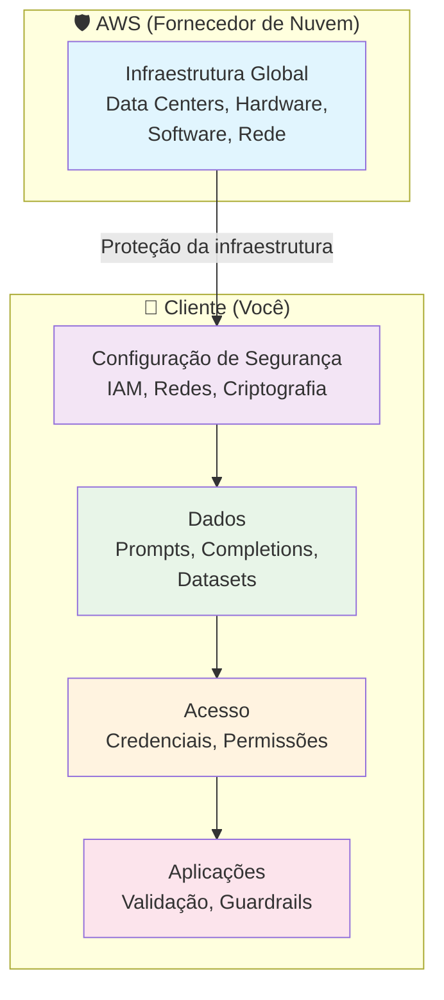
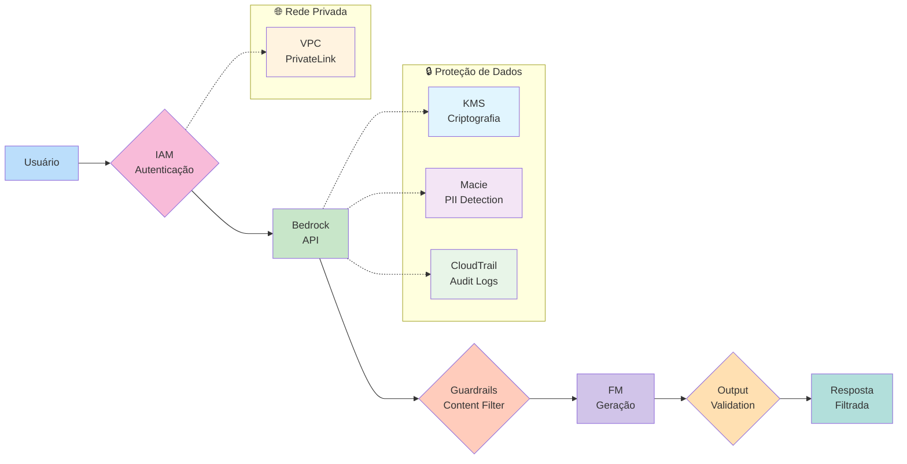
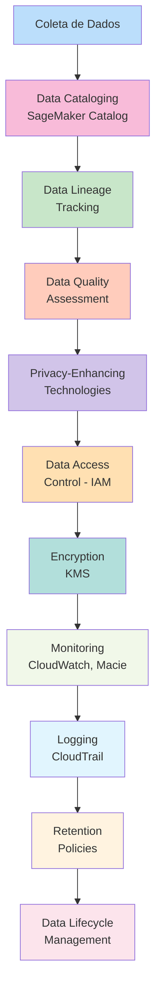
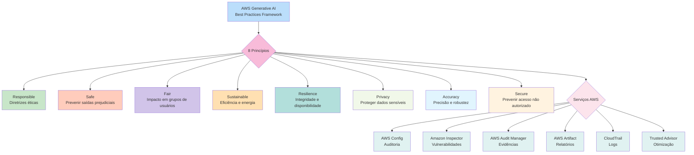
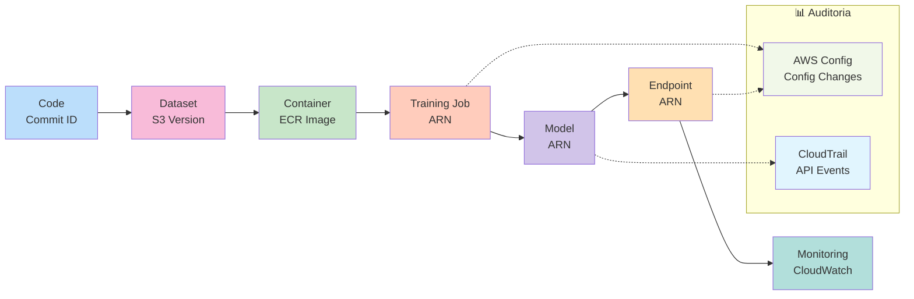

# 🔒 Segurança, Conformidade e Governança para Soluções de IA

| Certificado | Certificado |
| :--- | :---: |
| **Security, Compliance, and Governance for AI Solutions** (AWS) |  |

> **Curso: Security, Compliance, and Governance for AI Solutions | Plano de Estudos AWS AI Practitioner | Nível: Fundamental**

---

## 📖 Visão Geral

O curso **Security, Compliance, and Governance for AI Solutions** é o último módulo do **Plano de Estudos AWS Artificial Intelligence Practitioner**. Neste módulo, você explorará as estratégias e diretrizes para proteger sistemas de IA, garantir conformidade regulatória e implementar governança eficaz.

Você aprenderá sobre o **modelo de responsabilidade compartilhada** da AWS, serviços para proteção de dados (como **Amazon Macie** e **AWS PrivateLink**), criptografia, controle de acesso via **IAM**, e como documentar a origem dos dados com **data lineage** e **SageMaker Model Cards**. Também explorará padrões de conformidade (ISO, SOC, GDPR, HIPAA), estratégias de governança de dados e o **AWS Generative AI Best Practices Framework**.

Este documento é baseado **exclusivamente** na documentação oficial da AWS:
- [AWS Certified AI Practitioner (AIF-C01) Exam Guide](https://d1.awsstatic.com/training-and-certification/docs-ai-practitioner/AWS-Certified-AI-Practitioner_Exam-Guide.pdf)
- [AWS Certification - Domain 5: Security, Compliance, and Governance](https://docs.aws.amazon.com/aws-certification/latest/ai-practitioner-01/ai-practitioner-01-domain5.html)
- [AWS Skill Builder - AI Practitioner Learning Plan](https://explore.skillbuilder.aws/)
- [Amazon Bedrock Documentation](https://docs.aws.amazon.com/bedrock/)
- [Amazon SageMaker Documentation](https://docs.aws.amazon.com/sagemaker/)
- [AWS Compliance Programs](https://aws.amazon.com/compliance/programs/)
- [AWS Prescriptive Guidance - Prompt Engineering](https://docs.aws.amazon.com/prescriptive-guidance/latest/llm-prompt-engineering-best-practices/)
- [AWS AI Services](https://aws.amazon.com/ai/)

---

## 📊 Peso no Exame AIF-C01

| Domínio | Peso | Task Statements |
|---------|------|-----------------|
| **Domain 5: Security, Compliance, and Governance for AI Solutions** | **14%** | 5.1, 5.2 |

---

## 1. 🛡️ Proteção de Sistemas de IA

> **Task Statement 5.1:** Explain methods to secure AI systems.

### 1.1 Modelo de Responsabilidade Compartilhada (Shared Responsibility Model)

O modelo de responsabilidade compartilhada da AWS define quem é responsável por diferentes aspectos da segurança:

| Responsabilidade | AWS (Fornecedor de Nuvem) | Cliente (Você) |
|------------------|--------------------------|-----------------|
| **Infraestrutura** | Proteção da infraestrutura global (data centers, hardware, software) | — |
| **Configuração de Segurança** | — | Configurar corretamente serviços AWS (IAM, redes, criptografia) |
| **Dados** | — | Proteger dados de entrada/saída, prompts, completions |
| **Acesso** | — | Gerenciar credenciais, permissões e controle de acesso |
| **Aplicações** | — | Implementar segurança na aplicação (validação de input, guardrails) |

> **Dica de Prova:** O modelo de responsabilidade compartilhada significa que a AWS protege a **infraestrutura**, mas **você** é responsável pela **configuração de segurança, dados, acesso e aplicações**.

### 1.2 IAM Roles, Policies e Permissions

O **AWS Identity and Access Management (IAM)** é o serviço fundamental para controlar o acesso a recursos de IA/ML:

| Recurso IAM | Função |
|-------------|--------|
| **IAM Roles** | Entidades que definem permissões para serviços ou usuários (ex: role para SageMaker, role para Bedrock) |
| **IAM Policies** | Documentos JSON que definem permissões (ex: permissão para acessar S3, invocar modelos Bedrock) |
| **IAM Users/Groups** | Contas individuais e grupos de usuários com permissões específicas |
| **IAM Identity Center** | Single sign-on (SSO) para acesso centralizado |

**Práticas recomendadas:**
- Conceda apenas as permissões necessárias (princípio de menor privilégio)
- Use roles em vez de credenciais de usuário para serviços
- Ative a autenticação multifator (MFA) para contas administrativas

### 1.3 Criptografia

A criptografia protege dados em repouso (at rest) e em trânsito (in transit):

| Tipo | Descrição | Serviços AWS |
|------|-----------|-------------|
| **Encryption at Rest** | Dados criptografados quando armazenados | AWS KMS, Amazon S3 SSE, Amazon EBS, Amazon RDS |
| **Encryption in Transit** | Dados criptografados durante transmissão | TLS 1.2 (mínimo), TLS 1.3 (recomendado), AWS PrivateLink |
| **FIPS Endpoints** | Endpoints validados FIPS 140-3 para criptografia | AWS KMS, Amazon Bedrock FIPS endpoints |

**Configurações no Amazon Bedrock:**
- **In Transit:** TLS 1.2 obrigatório, TLS 1.3 recomendado
- **At Rest:** Criptografia padrão da AWS em todos os serviços
- **Custom KMS Keys:** Opção de usar chaves KMS personalizadas para criptografia de modelos customizados

### 1.4 Amazon Macie

O **Amazon Macie** é um serviço de segurança de dados que usa aprendizado de máquina e corredores de segurança para proteger dados confidenciais armazenados no Amazon S3:

| Recurso | Descrição |
|---------|-----------|
| **Descoberta automática de dados sensíveis** | Identifica automaticamente dados sensíveis (PII, credenciais, chaves) em buckets S3 |
| **Monitoramento contínuo** | Monitora buckets S3 para novos dados sensíveis |
| **Integração com CloudWatch** | Envia alertas para o Amazon CloudWatch |
| **Integração com AWS Organizations** | Suporte a múltiplas contas organizacionais |

**Casos de uso:**
- Detecção de vazamento de dados (data leakage prevention)
- Descoberta de PII em datasets de treinamento
- Monitoramento de dados sensíveis em repostórios de modelos

### 1.5 AWS PrivateLink

O **AWS PrivateLink** permite acessar serviços AWS de forma privada, sem expor o tráfego à internet pública:

| Benefício | Descrição |
|-----------|-----------|
| **Privacidade** | Tráfego permanece dentro da rede privada da AWS |
| **Segurança** | Reduz exposição a ameaças da internet |
| **Controle de acesso** | Políticas de acesso baseadas em VPC |
| **Compatibilidade** | Suportado por Amazon Bedrock, SageMaker, e outros serviços de IA |

### 1.6 Bedrock Guardrails

As **Barreiras de Proteção para Amazon Bedrock** ajudam a implementar proteções para aplicações de IA generativa:

| Recurso | Descrição |
|---------|-----------|
| **Content filtering** | Filtra conteúdo tóxico, ofensivo ou indesejado |
| **PII suppression** | Suprime informações de identificação pessoal (PII) |
| **Prompt attack detection** | Detecta e bloqueia ataques de prompt injection |
| **Custom word lists** | Listas personalizadas de palavras bloqueadas |
| **Input/output filtering** | Filtra tanto entradas quanto saídas do modelo |

### 1.7 Considerações de Segurança e Privacidade

| Consideração | Descrição | Serviços AWS |
|-------------|-----------|-------------|
| **Application Security** | Proteção de aplicações contra vulnerabilidades | AWS WAF, AWS Shield, Bedrock Guardrails |
| **Threat Detection** | Detecção de ameaças em tempo real | Amazon Inspector, AWS Security Hub |
| **Vulnerability Management** | Gestão de vulnerabilidades | Amazon Inspector, AWS Systems Manager |
| **Infrastructure Protection** | Proteção da infraestrutura subjacente | AWS WAF, AWS Shield, Security Groups |
| **Prompt Injection** | Ataques que manipulam inputs para bypassar segurança | Bedrock Guardrails, input validation |
| **Data Leakage Prevention** | Prevenção de vazamento de dados | Amazon Macie, Bedrock Guardrails |
| **Output Filtering** | Filtragem de saídas do modelo | Bedrock Guardrails |
| **Audit Trail** | Rastreamento de interações com IA | AWS CloudTrail, CloudWatch Logs |
| **Toxicity** | Detecção de conteúdo tóxico | Bedrock Guardrails, Model Evaluation |

### 1.8 Práticas Recomendadas para Segurança

| Prática | Descrição |
|---------|-----------|
| **Multi-factor Authentication (MFA)** | Ative MFA para todas as contas administrativas |
| **SSL/TLS** | Use TLS 1.2+ para todas as comunicações (TLS 1.3 recomendado) |
| **API Logging** | Configure AWS CloudTrail para log de todas as API calls |
| **Encryption** | Use soluções de criptografia da AWS em todos os dados |
| **Amazon Macie** | Use para descobrir e proteger dados sensíveis no S3 |
| **IAM Least Privilege** | Conceda apenas permissões mínimas necessárias |
| **FIPS Endpoints** | Use endpoints FIPS para requisitos regulatórios |
| **Never put sensitive data in tags** | Nunca coloque dados sensíveis em tags ou campos de texto livre |

> **Dica de Prova:** Para segurança de IA, lembre-se: **IAM** = controle de acesso; **KMS** = criptografia; **Macie** = dados sensíveis no S3; **PrivateLink** = conectividade privada; **Guardrails** = filtragem de conteúdo e prompt injection.

---

## 2. 📊 Linhagem de Dados e Data Cataloging

> **Task Statement 5.1:** Understand the concept of source citation and documenting data origins.

### 2.1 Data Lineage (Linhagem de Dados)

**Data lineage** é o rastreamento completo de onde os dados vieram, como foram transformados e como chegaram ao modelo. É essencial para auditoria, compliance e reprodução de resultados.

#### Componentes do Data Lineage

| Componente | Como é rastreado | Ferramentas AWS |
|------------|------------------|-----------------|
| **Code versioning** | Versionamento de código por commit ID | AWS CodeCommit, GitLab, Bitbucket |
| **Dataset versioning** | Versionamento de datasets via S3 partition scheme | Amazon S3, DVC (Data Version Control) |
| **Container versioning** | Imagens identificadas por Image URI + digest | Amazon ECR |
| **Training job versioning** | Jobs identificados por ARN com metadados | Amazon SageMaker AI |
| **Model versioning** | Model packages registrados com ARN | SageMaker Model Registry |
| **Endpoint versioning** | Endpoints identificados por ARN | SageMaker Endpoints |
| **Infrastructure changes** | Mudanças de configuração rastreadas | AWS Config, AWS CloudTrail |

### 2.2 SageMaker Model Cards

Os **Amazon SageMaker Model Cards** são um recurso para documentar detalhes críticos sobre modelos de ML em um único local, facilitando governança e relatórios:

#### Informações Capturadas

| Categoria | Detalhes |
|-----------|----------|
| **Model Details** | Descrição, criador, owner, local de artefatos, tipo de algoritmo, tipo de problema |
| **Intended Uses** | Propósito, casos de uso pretendidos, casos não pretendidos, pressupostos, fatores de eficiência |
| **Risk Ratings** | Classificação de risco (unknown, low, medium, high) com explicações |
| **Business Details** | Problema de negócio, stakeholders, linha de negócio |
| **Training Details** | Função objetivo, observações, ARN do job, local de datasets, ambiente, métricas, hiperparâmetros |
| **Evaluation Results** | Observações, ARN do job, datasets, metadados, grupos de métricas |
| **Additional Information** | Considerações éticas, recomendações, detalhes customizados |

#### Como Funciona

1. **Integração com Model Registry** — Model Cards são integrados ao SageMaker Model Registry
2. **Versionamento** — Edições criam novas versões (imutabilidade)
3. **Exportação** — Podem ser exportados para PDF ou baixados
4. **Avaliação em JSON** — Resultados de avaliação em formato JSON (SageMaker Clarify, Model Monitor)

#### Suporte a Governança e Transparência

- **Governança simplificada** — Centraliza detalhes críticos do modelo
- **IA responsável** — Documenta práticas responsáveis de IA
- **Diretrizes de uso** — Instruções claras sobre como usar o modelo
- **Auditoria** — Suporte a atividades de auditoria
- **Gestão de riscos** — Categorização de ratings de risco

### 2.3 Data Cataloging

O **Amazon SageMaker Catalog** (anteriormente AWS Glue Data Catalog) é um repositório centralizado de metadados para dados:

| Recurso | Descrição |
|---------|-----------|
| **Centralização de metadados** | Armazena esquemas, definições de tabelas e metadados |
| **Descoberta automática** | Crawlers identificam e catalogam dados automaticamente |
| **Integração com Athena** | Consultas SQL diretamente no catálogo |
| **Controle de acesso** | Políticas de acesso baseadas em recursos |

### 2.4 Ferramentas de Auditoria

| Ferramenta | Função |
|------------|--------|
| **AWS Config** | Avalia, audita e avalia configurações de recursos AWS; rastreia mudanças |
| **AWS CloudTrail** | Registra eventos de API para operações de criação, exclusão e atualização |
| **Amazon CloudWatch** | Monitora métricas e logs em tempo real |
| **AWS Artifact** | Acesso sob demanda a relatórios de conformidade da AWS |

> **Dica de Prova:** **Data lineage** rastreia a origem e transformação dos dados. **Model Cards** documentam detalhes do modelo. **AWS Config** e **CloudTrail** são para auditoria.

---

## 3. 🔒 Engenharia de Dados Segura

> **Task Statement 5.1:** Describe best practices for secure data engineering.

### 3.1 Privacy-Enhancing Technologies (PETs)

Tecnologias de privacidade que minimizam a exposição de dados sensíveis:

| Tecnologia | Descrição | Uso |
|------------|-----------|-----|
| **Differential Privacy** | Adiciona ruído estatístico para proteger identidades individuais | Treinamento de modelos com dados sensíveis |
| **Homomorphic Encryption** | Permite computação em dados criptografados sem descriptografá-los | Inferência em dados sensíveis |
| **Secure Multi-party Computation** | Múltiplas partes computam juntas sem compartilhar dados brutos | Colaboração entre organizações |
| **Data Anonymization** | Remoção de informações identificáveis | Compartilhamento de datasets |
| **Data Masking** | Substituição de dados sensíveis por valores fictícios | Desenvolvimento e teste |

### 3.2 Data Access Control

| Estratégia | Descrição |
|------------|-----------|
| **IAM Policies** | Políticas baseadas em identidade para controle de acesso |
| **Resource Policies** | Políticas baseadas em recursos (ex: bucket policies S3) |
| **VPC Security** | Grupos de segurança e listas de controle de acesso (ACLs) |
| **Encryption** | Criptografia como camada de proteção adicional |
| **Audit Logging** | Registro de todas as operações de acesso para auditoria |

### 3.3 Data Integrity

| Prática | Descrição |
|---------|-----------|
| **Checksums** | Verificação de integridade usando hashes (MD5, SHA-256) |
| **Version Control** | Controle de versão para detectar alterações não autorizadas |
| **Immutable Storage** | Armazenamento imutável (S3 Object Lock) |
| **Digital Signatures** | Assinaturas digitais para autenticação de dados |

### 3.4 Data Quality Assessment

| Aspecto | Descrição |
|---------|-----------|
| **Completeness** | Dados completos sem valores ausentes |
| **Accuracy** | Dados corretos e precisos |
| **Consistency** | Dados consistentes entre fontes |
| **Timeliness** | Dados atualizados e relevantes |
| **Validity** | Dados que seguem formatos e regras definidas |

### 3.5 Práticas Recomendadas para Engenharia de Dados Segura

| Prática | Serviço AWS |
|---------|-------------|
| **Assess data quality** | Amazon Deequ, SageMaker Data Wrangler |
| **Implement privacy-enhancing technologies** | AWS KMS, Macie, Bedrock Guardrails |
| **Data access control** | IAM, S3 Bucket Policies, VPC Security Groups |
| **Data integrity** | S3 Object Lock, CloudTrail, checksums |
| **Encryption** | AWS KMS, S3 SSE, EBS Encryption |
| **Logging** | CloudTrail, CloudWatch, Macie |

> **Dica de Prova:** Para engenharia de dados segura: **PETs** = privacy-enhancing technologies; **data access control** = IAM + resource policies; **data integrity** = checksums + version control; **data quality** = completeness, accuracy, consistency.

---

## 4. 📜 Governança e Conformidade

> **Task Statement 5.2:** Recognize governance and compliance regulations for AI systems.

### 4.1 Padrões de Conformidade (Compliance Standards)

| Padrão | Descrição | Escopo |
|--------|-----------|--------|
| **ISO 27001** | Sistema de gestão de segurança da informação | Segurança da informação em geral |
| **ISO 27017** | Controle de segurança para serviços de nuvem | Segurança de serviços em nuvem |
| **ISO 27018** | Proteção de dados pessoais na nuvem | Dados pessoais em serviços de nuvem |
| **ISO 27701** | Extensão do ISO 27001 para privacidade | Gestão de privacidade e proteção de dados |
| **SOC 1/2/3** | Relatórios de segurança, disponibilidade e confidencialidade | Serviços de nuvem em geral |
| **GDPR** | Regulamento Geral de Proteção de Dados (UE) | Proteção de dados pessoais na UE |
| **HIPAA** | Health Insurance Portability and Accountability Act | Dados de saúde nos EUA |
| **Algorithm Accountability Laws** | Leis que exigem explicabilidade e justiça em algoritmos | Sistemas de IA e ML |

### 4.2 Serviços AWS para Governança e Conformidade

| Serviço | Função |
|---------|--------|
| **AWS Config** | Avalia, audita e avalia configurações de recursos AWS; rastreia mudanças de configuração |
| **Amazon Inspector** | Avaliação automatizada de vulnerabilidades e exposições de segurança |
| **AWS Audit Manager** | Coleta de evidências automatizada para auditoria e compliance |
| **AWS Artifact** | Acesso sob demanda a relatórios de conformidade e segurança da AWS |
| **AWS CloudTrail** | Registro de eventos de API e atividades de usuários |
| **AWS Trusted Advisor** | Verificações de melhor prática para otimização de custos, segurança e performance |

### 4.3 Estratégias de Governança de Dados

| Estratégia | Descrição |
|------------|-----------|
| **Data Lifecycles** | Gestão do ciclo de vida dos dados (criação, uso, arquivamento, exclusão) |
| **Logging** | Registro de todas as operações e acessos para auditoria |
| **Data Residency** | Garantir que dados permaneçam em regiões geográficas específicas |
| **Monitoring** | Monitoramento contínuo de atividades e anomalias |
| **Observation** | Observação de padrões de uso e comportamento |
| **Data Retention** | Políticas de retenção de dados com períodos definidos |

### 4.4 Processos de Governança

| Processo | Descrição |
|----------|-----------|
| **Policies** | Definição de políticas de governança para IA |
| **Review Cadence** | Frequência de revisão de políticas e conformidade |
| **Review Strategies** | Estratégias para revisão de sistemas de IA |
| **Generative AI Security Scoping Matrix** | Framework para escopo de segurança de IA generativa |
| **Transparency Standards** | Padrões de transparência para sistemas de IA |
| **Team Training Requirements** | Requisitos de treinamento para equipes de IA |

### 4.5 AWS Generative AI Best Practices Framework

O **AWS Generative AI Best Practices Framework v2** (disponível no AWS Audit Manager) avalia implementações de IA generativa baseadas em **8 princípios**:

| Princípio | Descrição | Exemplo de Prática |
|-----------|-----------|-------------------|
| **Responsible** | Desenvolver e seguir diretrizes éticas | Documentar origem, natureza e qualidade dos dados |
| **Safe** | Estabelecer parâmetros para prevenir saídas prejudiciais | Avaliar modelo regularmente com métricas de performance |
| **Fair** | Considerar impacto em diferentes grupos de usuários | Monitoramento automatizado de vieses |
| **Sustainable** | Maior eficiência e fontes de energia sustentáveis | Documentar cenários de reutilização de modelos |
| **Resilience** | Manter integridade e disponibilidade | Monitoramento em tempo real com alertas |
| **Privacy** | Proteger dados sensíveis de roubo e exposição | Procedimentos para notificação de vazamento de PII |
| **Accuracy** | Sistemas precisos, confiáveis e robustos | Detecção de imprecisões e análise de erros |
| **Secure** | Prevenir acesso não autorizado | Criptografia de ponta a ponta para dados de entrada/saída |

**Detalhes do Framework:**
- **72 controles automatizados** (mapeiam para AWS Config, CloudTrail, Bedrock API operations)
- **38 controles manuais**
- **8 conjuntos de controle** (um por princípio)
- **Evidências coletadas automaticamente** via AWS Config e CloudTrail

> **Dica de Prova:** Para governança: **ISO 27001/27017/27018/27701** = padrões de segurança/privacidade; **SOC** = relatórios de nuvem; **GDPR** = privacidade na UE; **HIPAA** = dados de saúde. **AWS Config** = configuração; **Inspector** = vulnerabilidades; **Audit Manager** = auditoria; **Artifact** = relatórios; **CloudTrail** = logs; **Trusted Advisor** = otimização.

---

## 5. 📊 Representação Visual (Mermaid.js)

### 5.1 Modelo de Responsabilidade Compartilhada

### 5.2 Arquitetura de Segurança para Sistemas de IA

### 5.3 Fluxo de Governança de Dados

### 5.4 Framework de Governança de IA Generativa (8 Princípios)

### 5.5 Ciclo de Vida de Dados e Modelos

---

## 6. 📌 Dicas para a Prova AIF-C01

> *"Domínio 5 representa 14% do exame — foco em segurança, compliance e governança de sistemas de IA"*

### 6.1 Segurança de Sistemas de IA (Task 5.1)

| Pergunta | Resposta Correta | Erro Comum |
|----------|------------------|------------|
| "Quem é responsável pela infraestrutura física?" | AWS (Shared Responsibility Model) | Cliente |
| "Quem é responsável pela configuração de segurança?" | Cliente | AWS |
| "Serviço para detecção de dados sensíveis no S3?" | Amazon Macie | Amazon Inspector |
| "Serviço para conectividade privada?" | AWS PrivateLink | Amazon VPC |
| "Serviço para filtrar conteúdo tóxico?" | Bedrock Guardrails | Amazon Comprehend |
| "Protocolo obrigatório para criptografia em trânsito?" | TLS 1.2 | SSL |
| "Serviço para criptografia de dados?" | AWS KMS | AWS IAM |
| "Ataque que manipula inputs do modelo?" | Prompt injection | Data poisoning |

### 6.2 Linhagem de Dados e Model Cards (Task 5.1)

| Pergunta | Resposta Correta | Erro Comum |
|----------|------------------|------------|
| "Ferramenta para documentar modelos?" | SageMaker Model Cards | SageMaker Feature Store |
| "Serviço para auditoria de configurações?" | AWS Config | AWS CloudTrail |
| "Serviço para log de eventos de API?" | AWS CloudTrail | AWS Config |
| "Serviço para relatórios de conformidade?" | AWS Artifact | AWS Audit Manager |
| "Conceito de rastreamento de origem de dados?" | Data lineage | Data cataloging |

### 6.3 Engenharia de Dados Segura (Task 5.1)

| Pergunta | Resposta Correta | Erro Comum |
|----------|------------------|------------|
| "Tecnologia para proteger privacidade em dados?" | Privacy-enhancing technologies (PETs) | Data masking |
| "Prática para verificar integridade de dados?" | Checksums / hashes | Encryption |
| "Prática para controle de acesso?" | IAM policies | Data quality |
| "Serviço para detecção de PII no S3?" | Amazon Macie | AWS KMS |
| "Prática para autenticação forte?" | Multi-factor Authentication (MFA) | IAM roles |

### 6.4 Governança e Conformidade (Task 5.2)

| Pergunta | Resposta Correta | Erro Comum |
|----------|------------------|------------|
| "Padrão ISO para segurança da informação?" | ISO 27001 | ISO 27017 |
| "Padrão ISO para privacidade de dados?" | ISO 27701 | ISO 27018 |
| "Padrão ISO para serviços de nuvem?" | ISO 27017 | ISO 27001 |
| "Regulamento de privacidade na UE?" | GDPR | HIPAA |
| "Regulação de dados de saúde nos EUA?" | HIPAA | GDPR |
| "Serviço para avaliação de vulnerabilidades?" | Amazon Inspector | AWS Config |
| "Serviço para auditoria automatizada?" | AWS Audit Manager | AWS Trusted Advisor |
| "Serviço para acesso a relatórios de conformidade?" | AWS Artifact | AWS Audit Manager |
| "Serviço para verificações de otimização?" | AWS Trusted Advisor | Amazon Inspector |

### 6.5 Framework de Boas Práticas de IA Generativa

| Pergunta | Resposta Correta | Erro Comum |
|----------|------------------|------------|
| "Framework para governança de IA generativa?" | AWS Generative AI Best Practices Framework | AWS Well-Architected Framework |
| "Princípio: prevenir saídas prejudiciais?" | Safe | Secure |
| "Princípio: proteger dados sensíveis?" | Privacy | Security |
| "Princípio: prevenir acesso não autorizado?" | Secure | Safe |
| "Princípio: considerar impacto em grupos?" | Fair | Responsible |

### 6.6 Checklist de Revisão Final

- [ ] Entendi o modelo de responsabilidade compartilhada (AWS vs. Cliente)
- [ ] Sei usar IAM roles, policies e permissions para controle de acesso
- [ ] Entendo criptografia at rest e in transit (KMS, TLS)
- [ ] Conheço Amazon Macie para detecção de dados sensíveis
- [ ] Sei usar AWS PrivateLink para conectividade privada
- [ ] Entendo Bedrock Guardrails para proteção de conteúdo
- [ ] Conheço os riscos de prompt injection e como mitigá-los
- [ ] Entendo data lineage e como rastrear origem de dados
- [ ] Sei usar SageMaker Model Cards para documentação de modelos
- [ ] Conheço AWS Config, CloudTrail, Artifact, Audit Manager, Inspector, Trusted Advisor
- [ ] Entendo estratégias de governança de dados (lifecycle, logging, residency, retention)
- [ ] Conheço padrões de conformidade (ISO 27001/27017/27018/27701, SOC, GDPR, HIPAA)
- [ ] Sei os 8 princípios do AWS Generative AI Best Practices Framework
- [ ] Pratiquei questões de múltipla resposta (sem pontuação parcial)

---

## 🔗 Referências Oficiais

- **AWS Certified AI Practitioner (AIF-C01) Exam Guide**: https://d1.awsstatic.com/training-and-certification/docs-ai-practitioner/AWS-Certified-AI-Practitioner_Exam-Guide.pdf
- **AWS Certification - Domain 5: Security, Compliance, and Governance**: https://docs.aws.amazon.com/aws-certification/latest/ai-practitioner-01/ai-practitioner-01-domain5.html
- **AWS Skill Builder - AI Practitioner Learning Plan**: https://explore.skillbuilder.aws/
- **Amazon Bedrock Documentation**: https://docs.aws.amazon.com/bedrock/
- **Amazon Bedrock Data Protection**: https://docs.aws.amazon.com/bedrock/latest/userguide/data-protection.html
- **Amazon Bedrock Guardrails**: https://docs.aws.amazon.com/bedrock/latest/userguide/guardrails.html
- **Amazon SageMaker Model Cards**: https://docs.aws.amazon.com/sagemaker/latest/dg/model-cards.html
- **Amazon SageMaker Documentation**: https://docs.aws.amazon.com/sagemaker/
- **AWS Audit Manager - Generative AI Best Practices**: https://docs.aws.amazon.com/audit-manager/latest/userguide/aws-generative-ai-best-practices.html
- **AWS Compliance Programs**: https://aws.amazon.com/compliance/programs/
- **AWS Data Protection and Privacy**: https://aws.amazon.com/compliance/data-protection/
- **AWS Prescriptive Guidance - Prompt Engineering**: https://docs.aws.amazon.com/prescriptive-guidance/latest/llm-prompt-engineering-best-practices/
- **AWS Well-Architected Framework**: https://aws.amazon.com/architecture/well-architected/
- **AWS AI Services**: https://aws.amazon.com/ai/

---

> **Regra de Ouro**: Todo conteúdo neste repositório é baseado na documentação oficial da AWS. As dicas de prova são compiladas de fontes confiáveis e atualizadas, mas sempre cross-reference com o **Exam Guide oficial da AWS** para a informação mais current.

---

## 📂 Navegação

| Direção | Link |
|---------|------|
| **← Módulo Anterior** | [Optimizing Foundation Models](../optimizing-foundation-models/readme.md) |
| **→ Próximo Módulo** | [Security, Compliance, and Governance](../security-governance/readme.md) *(planejado)* |
| **↑ Voltar ao Índice** | [AWS AI Practitioner README](../README.md) |